# River Raid JS Fullstack Architecture Document

## Section 1: Introduction

This document outlines the complete fullstack architecture for River Raid JS, including backend systems, frontend implementation, and their integration. It serves as the single source of truth for AI-driven development, ensuring consistency across the entire technology stack.

This unified approach combines what would traditionally be separate backend and frontend architecture documents, streamlining the development process for modern fullstack applications where these concerns are increasingly intertwined.

### Starter Template or Existing Project

After reviewing the PRD and front-end specification, I found no mention of starter templates or existing projects. This appears to be a greenfield project with the following key constraints:

- **Zero-dollar budget** requiring only free/open-source solutions
- **Client-side only** - no backend services required for MVP
- **Static website deployment** (GitHub Pages, Netlify, or Vercel)
- **JavaScript game library** recommendation (Phaser or PixiJS)

**Status: N/A - Greenfield project**

### Change Log

| Date | Version | Description | Author |
|------|---------|-------------|---------|
| 2025-09-25 | 1.0 | Initial architecture document | Winston, Architect |

---

## Section 2: High Level Architecture

### Technical Summary

River Raid JS is a client-side single-page application (SPA) built as a browser-based arcade game using modern JavaScript and a 2D game rendering engine. The architecture employs a component-based game object system with Phaser.js for rendering and physics, deployed as static assets to a CDN-backed hosting platform. The game requires no backend services for MVP, maintaining all game state client-side with a focus on achieving consistent 60 FPS performance across desktop and mobile browsers. This architecture delivers on the PRD's vision of an instantly accessible, high-performance web game that faithfully recreates the classic River Raid experience with modern enhancements.

### Platform and Infrastructure Choice

Based on the PRD requirements for zero-cost deployment and client-side only architecture, here are the viable platform options:

**Option 1: Vercel (Recommended)**
- **Pros**: Excellent performance, automatic HTTPS, global CDN, great DX, generous free tier
- **Cons**: Overkill for static site, but no real downsides for this use case

**Option 2: GitHub Pages**
- **Pros**: Completely free, integrated with Git workflow, simple deployment
- **Cons**: Limited to 100GB bandwidth/month, no custom headers, basic CDN

**Option 3: Netlify**
- **Pros**: Good free tier, form handling (future use), serverless functions (future expansion)
- **Cons**: 100GB bandwidth limit on free tier

**Recommendation**: Vercel for its superior performance and developer experience, crucial for a 60 FPS game.

**Platform:** Vercel  
**Key Services:** Static hosting, Edge network CDN, Automatic HTTPS, Analytics (basic)  
**Deployment Host and Regions:** Global edge network (automatic region selection based on user location)

### Repository Structure

Given the project's scope and single-developer nature specified in the PRD, a simple monorepo structure is optimal:

**Structure:** Monorepo  
**Monorepo Tool:** None required (npm workspaces if future backend added)  
**Package Organization:** Single package for now, prepared for expansion with logical separation of game engine, assets, and UI code

### High Level Architecture Diagram

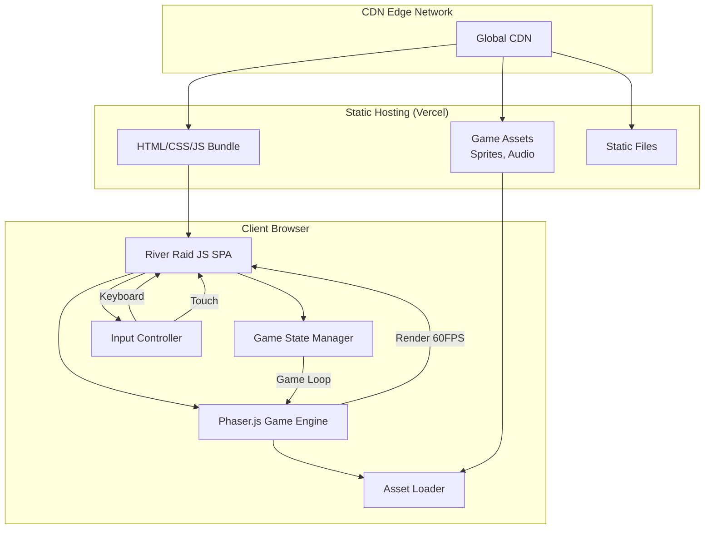

### Architectural Patterns

- **Component-Entity System:** Game objects (jet, enemies, fuel) as composable entities with behavior components - _Rationale:_ Enables clean separation of concerns and easy addition of new game objects
- **State Machine Pattern:** Explicit game states (Start, Playing, GameOver) with clear transitions - _Rationale:_ Prevents invalid state transitions and simplifies game flow logic
- **Observer Pattern:** Event-driven communication between game systems (collision, scoring, fuel) - _Rationale:_ Decouples game systems allowing independent testing and modification
- **Object Pool Pattern:** Reusable pools for bullets, enemies, and particles - _Rationale:_ Critical for maintaining 60 FPS by avoiding garbage collection during gameplay
- **Module Pattern:** ES6 modules for code organization and encapsulation - _Rationale:_ Native browser support, tree-shaking for optimal bundle size
- **Singleton Pattern:** Single instances for Game Manager, Asset Manager, Input Manager - _Rationale:_ Ensures single source of truth for critical game systems
- **Static Site Generation:** Pre-built assets served directly from CDN - _Rationale:_ Optimal performance and zero server costs as required by PRD

---

## Section 3: Tech Stack

This is the DEFINITIVE technology selection for the entire project. All development must use these exact versions.

### Technology Stack Table

| Category | Technology | Version | Purpose | Rationale |
|----------|------------|---------|---------|-----------|
| Frontend Language | JavaScript (ES6+) | ES2022 | Core game logic and UI | Native browser support, no transpilation needed for modern browsers |
| Frontend Framework | Phaser | 3.70.0 | 2D game engine and rendering | Comprehensive game features, excellent performance, active community |
| UI Component Library | None (Vanilla JS) | - | Simple UI screens | Game UI is minimal, no component library needed |
| State Management | Custom State Machine | - | Game state management | Lightweight, specific to game needs, no external dependencies |
| Backend Language | N/A | - | - | Client-side only application |
| Backend Framework | N/A | - | - | Client-side only application |
| API Style | N/A | - | - | No API needed for MVP |
| Database | N/A | - | - | No persistence required for MVP |
| Cache | LocalStorage | HTML5 | High score storage (future) | Browser native, no dependencies |
| File Storage | Static Assets | - | Game sprites and audio | Served directly from CDN |
| Authentication | N/A | - | - | No user accounts in MVP |
| Frontend Testing | Vitest | 1.6.0 | Unit and integration tests | Fast, ESM native, Jest compatible |
| Backend Testing | N/A | - | - | No backend |
| E2E Testing | Playwright | 1.44.0 | Automated gameplay testing | Cross-browser testing, great debugging |
| Build Tool | Vite | 5.2.0 | Development and bundling | Lightning fast, ESM native, zero config |
| Bundler | Rollup (via Vite) | 4.17.0 | Production bundling | Tree shaking, code splitting, optimal bundles |
| IaC Tool | N/A | - | - | Static hosting requires no infrastructure |
| CI/CD | GitHub Actions | - | Automated testing and deployment | Free for public repos, integrated with GitHub |
| Monitoring | Vercel Analytics | Basic | Performance and usage metrics | Free tier sufficient, automatic with Vercel |
| Logging | Console (dev only) | - | Development debugging | No production logging needed for MVP |
| CSS Framework | None (Minimal CSS) | - | Basic styling only | Game rendered to canvas, minimal CSS needed |

---

## Section 4: Data Models

Define the core data models/entities that will be shared between frontend components:

### Player

**Purpose:** Represents the player's jet aircraft with its position, fuel, and state

**Key Attributes:**
- x: number - Horizontal position on screen
- y: number - Vertical position on screen  
- fuel: number - Current fuel level (0-100)
- maxSpeed: number - Maximum speed based on fuel level
- currentSpeed: number - Current movement speed
- lives: number - Remaining lives (future feature)
- isAlive: boolean - Whether player is active

**TypeScript Interface:**
```typescript
interface Player {
  x: number;
  y: number;
  fuel: number;
  maxSpeed: number;
  currentSpeed: number;
  lives: number;
  isAlive: boolean;
}
```

**Relationships:**
- Creates Projectiles when firing
- Collides with Enemies, FuelDepots, and RiverBoundaries

### Enemy

**Purpose:** Represents hostile entities (ships and helicopters) that the player must avoid or destroy

**Key Attributes:**
- id: string - Unique identifier
- type: EnemyType - Ship or Helicopter enum
- x: number - Horizontal position
- y: number - Vertical position
- speed: number - Movement speed
- movementPattern: MovementPattern - How enemy moves
- points: number - Score value when destroyed
- width: number - Collision box width
- height: number - Collision box height

**TypeScript Interface:**
```typescript
enum EnemyType {
  SHIP = 'SHIP',
  HELICOPTER = 'HELICOPTER'
}

enum MovementPattern {
  STRAIGHT = 'STRAIGHT',
  ZIGZAG = 'ZIGZAG',
  HOVER = 'HOVER'
}

interface Enemy {
  id: string;
  type: EnemyType;
  x: number;
  y: number;
  speed: number;
  movementPattern: MovementPattern;
  points: number;
  width: number;
  height: number;
}
```

**Relationships:**
- Destroyed by Projectiles
- Collides with Player
- Cleared by Bombs

### FuelDepot

**Purpose:** Represents refueling stations that replenish the player's fuel when collected

**Key Attributes:**
- id: string - Unique identifier
- x: number - Horizontal position
- y: number - Vertical position
- fuelAmount: number - Amount of fuel provided
- isCollected: boolean - Whether already collected
- width: number - Collision box width
- height: number - Collision box height

**TypeScript Interface:**
```typescript
interface FuelDepot {
  id: string;
  x: number;
  y: number;
  fuelAmount: number;
  isCollected: boolean;
  width: number;
  height: number;
}
```

**Relationships:**
- Collected by Player on collision
- Affects Player fuel level

### Projectile

**Purpose:** Represents bullets fired by the player to destroy enemies

**Key Attributes:**
- id: string - Unique identifier
- x: number - Horizontal position
- y: number - Vertical position
- velocityX: number - Horizontal velocity
- velocityY: number - Vertical velocity
- damage: number - Damage dealt (for future enemy health)
- isActive: boolean - Whether projectile is still active

**TypeScript Interface:**
```typescript
interface Projectile {
  id: string;
  x: number;
  y: number;
  velocityX: number;
  velocityY: number;
  damage: number;
  isActive: boolean;
}
```

**Relationships:**
- Created by Player
- Destroys Enemies on collision
- Deactivated when off-screen or after collision

### GameState

**Purpose:** Manages the overall game state, score, and game flow

**Key Attributes:**
- currentState: GameStateType - Current game phase
- score: number - Player's current score
- highScore: number - Session high score
- bombs: number - Available screen-clear bombs
- scrollDirection: ScrollDirection - Current scrolling orientation
- scrollSpeed: number - Environment scroll rate
- gameTime: number - Elapsed game time
- difficulty: number - Current difficulty multiplier

**TypeScript Interface:**
```typescript
enum GameStateType {
  START_SCREEN = 'START_SCREEN',
  PLAYING = 'PLAYING',
  PAUSED = 'PAUSED',
  GAME_OVER = 'GAME_OVER'
}

enum ScrollDirection {
  VERTICAL = 'VERTICAL',
  HORIZONTAL = 'HORIZONTAL',
  TRANSITIONING = 'TRANSITIONING'
}

interface GameState {
  currentState: GameStateType;
  score: number;
  highScore: number;
  bombs: number;
  scrollDirection: ScrollDirection;
  scrollSpeed: number;
  gameTime: number;
  difficulty: number;
}
```

**Relationships:**
- Controls all game entities
- Manages state transitions
- Tracks scoring and progression

### RiverBoundary

**Purpose:** Represents the navigable river boundaries that constrain player movement

**Key Attributes:**
- leftBoundary: number[] - Array of x-coordinates for left edge
- rightBoundary: number[] - Array of x-coordinates for right edge
- segmentHeight: number - Height of each boundary segment
- currentOffset: number - Scroll offset for infinite scrolling

**TypeScript Interface:**
```typescript
interface RiverBoundary {
  leftBoundary: number[];
  rightBoundary: number[];
  segmentHeight: number;
  currentOffset: number;
}
```

**Relationships:**
- Constrains Player movement
- Defines navigable game area
- Updates with scroll direction changes

---

## Section 5: API Specification

Since River Raid JS is a purely client-side application with no backend services, there is no API to specify for the MVP.

**Status: N/A - Client-side only application**

Future versions may include:
- Leaderboard API for high score submission
- User profile and progress saving
- Multiplayer coordination services

These would be documented here when backend services are added.

---

## Section 6: Components

Based on the architectural patterns, tech stack, and data models defined above, here are the major logical components across the application:

### Game Engine Core

**Responsibility:** Initializes Phaser, manages the game loop, coordinates all subsystems, and handles scene transitions

**Key Interfaces:**
- `init()`: Initialize Phaser with game configuration
- `start()`: Begin game loop
- `pause()`: Pause game execution
- `resume()`: Resume from pause
- `destroy()`: Clean up resources

**Dependencies:** Phaser.js framework, all manager components

**Technology Stack:** Phaser 3.70.0 with WebGL/Canvas rendering

### Input Manager

**Responsibility:** Abstracts input handling across keyboard and touch, providing unified control events

**Key Interfaces:**
- `onMove(callback)`: Register movement handler
- `onFire(callback)`: Register fire action handler
- `onBomb(callback)`: Register bomb action handler
- `getInputState()`: Get current input state
- `enableTouch()`: Enable mobile touch controls

**Dependencies:** Game Engine Core

**Technology Stack:** Phaser Input API with custom touch overlay implementation

### Entity Manager

**Responsibility:** Manages lifecycle of all game entities (player, enemies, projectiles, fuel depots) using object pooling

**Key Interfaces:**
- `spawnEnemy(type, position)`: Create enemy from pool
- `spawnProjectile(position, velocity)`: Create projectile
- `spawnFuelDepot(position)`: Create fuel depot
- `recycleEntity(entity)`: Return to pool
- `updateAll(deltaTime)`: Update all active entities

**Dependencies:** Object pools, Physics Manager

**Technology Stack:** Custom object pooling system with Phaser GameObjects

### Physics Manager

**Responsibility:** Handles collision detection between all game entities and river boundaries

**Key Interfaces:**
- `checkCollisions()`: Detect all collisions this frame
- `registerCollisionHandler(typeA, typeB, handler)`: Set collision callbacks
- `updateBoundaries(boundaries)`: Update river collision boundaries
- `isInBounds(entity)`: Check if entity is within play area

**Dependencies:** Entity Manager, River Generator

**Technology Stack:** Phaser Arcade Physics with custom boundary checking

### State Manager

**Responsibility:** Manages game state transitions and persists current game state

**Key Interfaces:**
- `changeState(newState)`: Transition to new game state
- `getCurrentState()`: Get current state object
- `updateScore(points)`: Add to score
- `useBomb()`: Consume bomb if available
- `canPurchaseBomb()`: Check if score allows bomb purchase

**Dependencies:** None (standalone)

**Technology Stack:** Custom TypeScript state machine implementation

### Asset Manager

**Responsibility:** Loads and caches all game assets (sprites, audio, fonts) with loading progress

**Key Interfaces:**
- `loadAssets()`: Load all game assets
- `getSprite(key)`: Retrieve loaded sprite
- `getAudio(key)`: Retrieve loaded audio
- `onProgress(callback)`: Loading progress callback
- `isLoaded()`: Check if all assets ready

**Dependencies:** Game Engine Core

**Technology Stack:** Phaser LoaderPlugin with custom progress tracking

### Render Manager

**Responsibility:** Manages rendering layers, camera positioning, and visual effects

**Key Interfaces:**
- `setScrollDirection(direction)`: Update scroll orientation
- `addToLayer(entity, layer)`: Add entity to render layer
- `shake(intensity, duration)`: Screen shake effect
- `transition(from, to, duration)`: Scroll direction transition

**Dependencies:** Game Engine Core, Entity Manager

**Technology Stack:** Phaser Cameras and Display List

### River Generator

**Responsibility:** Procedurally generates river boundaries and manages infinite scrolling

**Key Interfaces:**
- `generateSegment()`: Create next river segment
- `updateScroll(speed)`: Update river position
- `transitionDirection()`: Switch between vertical/horizontal
- `getBoundaries()`: Get current collision boundaries
- `setDifficulty(level)`: Adjust river width/complexity

**Dependencies:** State Manager (for difficulty)

**Technology Stack:** Custom procedural generation with Phaser TileSprites

### Audio Manager

**Responsibility:** Handles all sound effects and background music with volume control

**Key Interfaces:**
- `playSound(key)`: Play one-shot sound effect
- `playMusic(key)`: Start background music
- `setVolume(level)`: Adjust master volume
- `mute()`: Mute all audio
- `fadeOut(duration)`: Fade out current music

**Dependencies:** Asset Manager

**Technology Stack:** Phaser Sound API with Web Audio

### UI Manager

**Responsibility:** Manages HUD elements, menus, and on-screen touch controls

**Key Interfaces:**
- `updateHUD(state)`: Update score, fuel, bombs display
- `showScreen(type)`: Display start/game over screens
- `showTouchControls()`: Enable mobile controls
- `hideUI()`: Hide all UI elements
- `animateScore(points)`: Score popup animation

**Dependencies:** State Manager, Asset Manager

**Technology Stack:** Phaser Text and Graphics objects with CSS for menus

### Component Diagrams

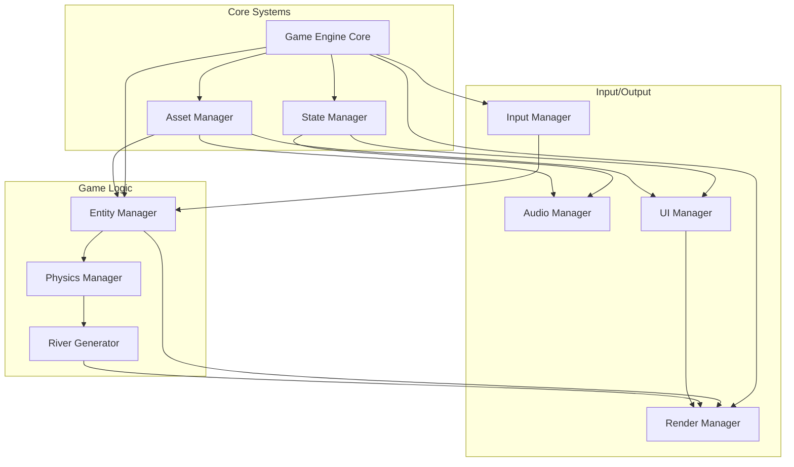

---

## Section 7: External APIs

No external APIs are required for the MVP version of River Raid JS. The game runs entirely client-side with no external service dependencies.

**Status: N/A - No external API integrations needed**

---

## Section 8: Core Workflows

Illustrate key system workflows using sequence diagrams:

### Game Initialization Workflow

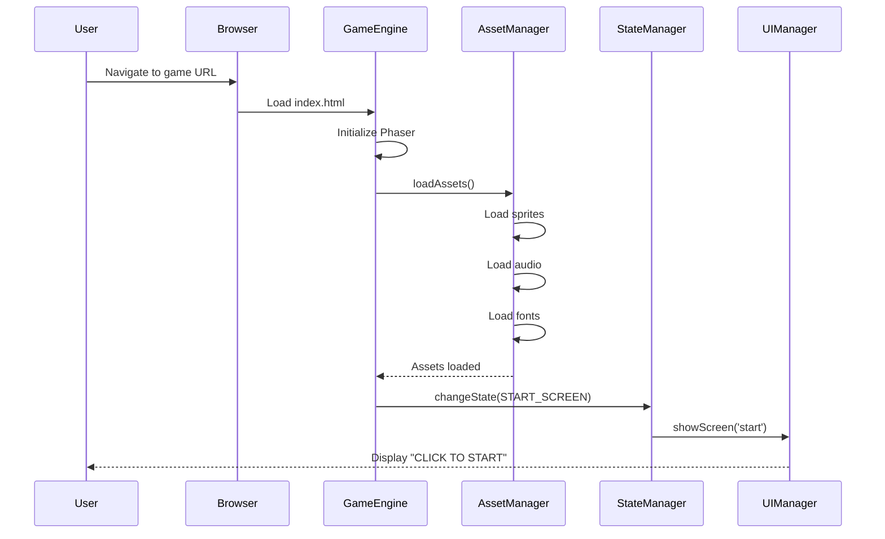

### Core Gameplay Loop

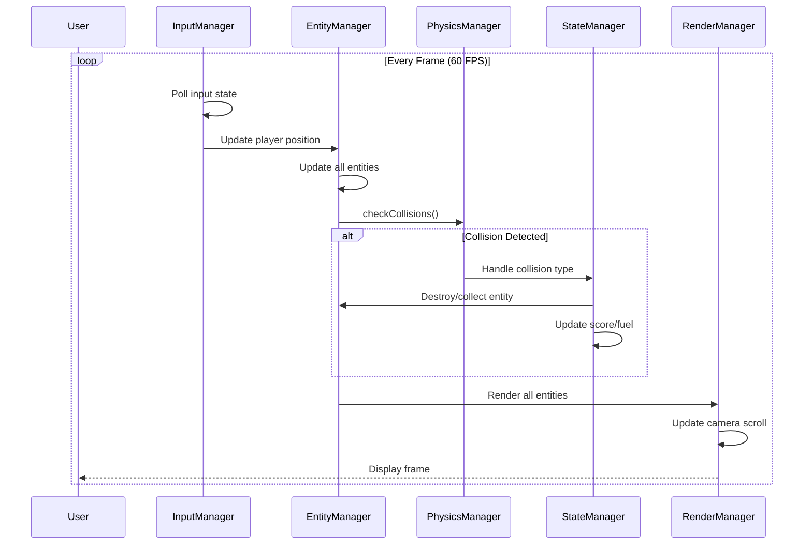

### Player Fire Action Workflow

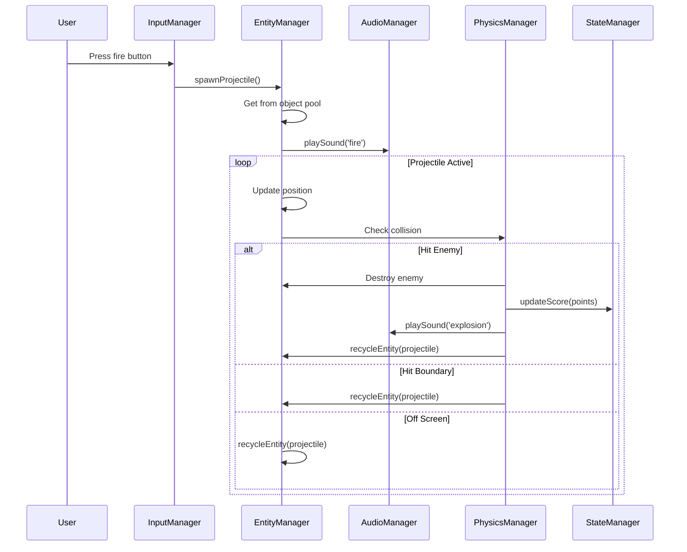

### Fuel Management Workflow

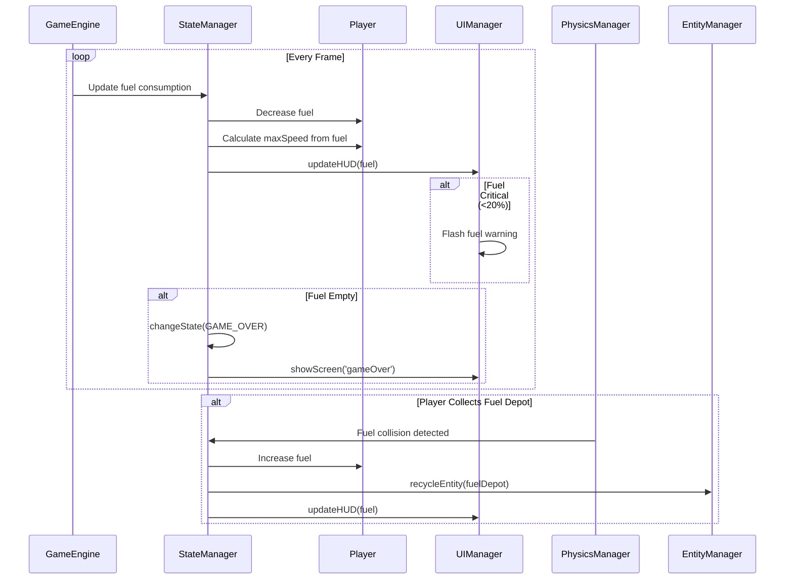

### Dynamic Scroll Direction Transition

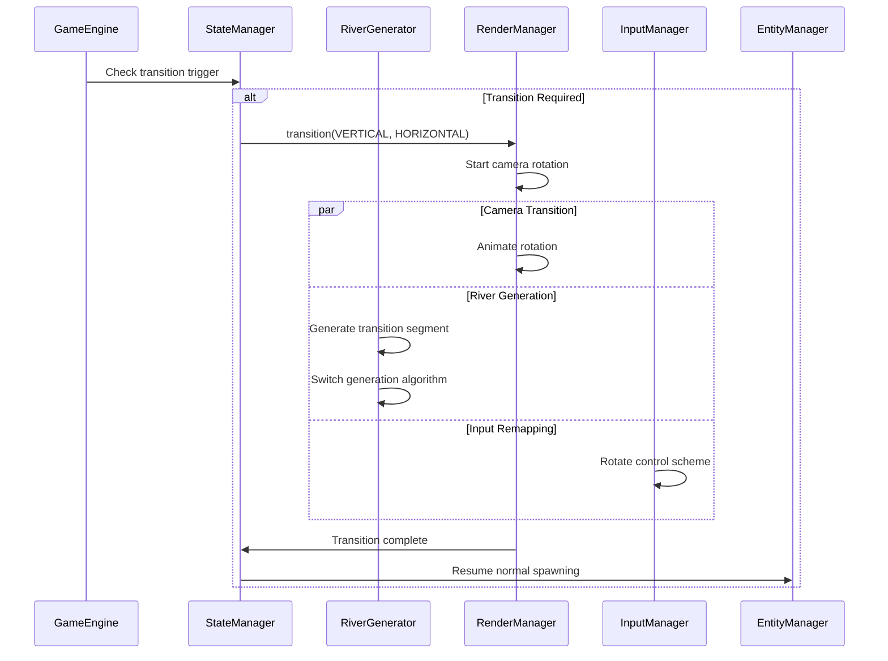

### Bomb Usage Workflow

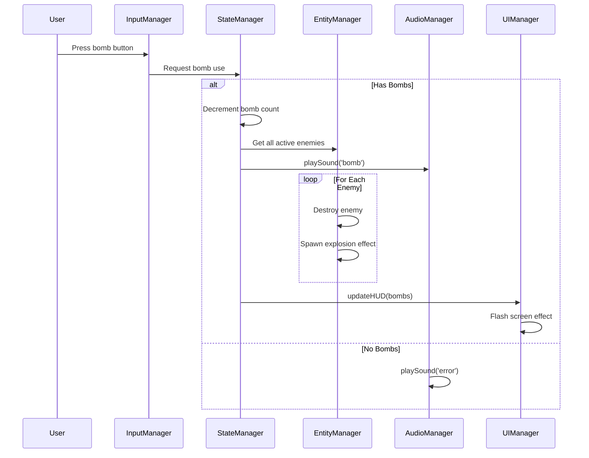

### Score-to-Bomb Purchase

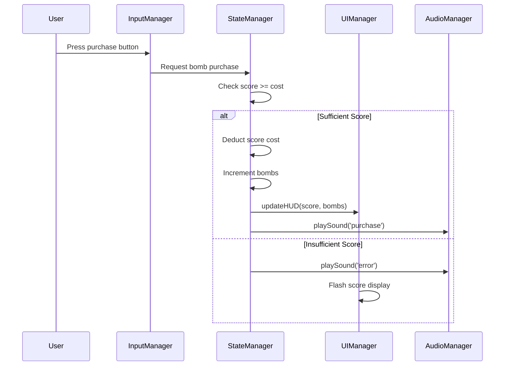

---

## Section 9: Database Schema

For the MVP version of River Raid JS, no database is required as the game runs entirely client-side. However, the game will use browser localStorage for minimal persistence.

### LocalStorage Schema

```javascript
// High Score Storage
{
  "riverraid_highscore": {
    "score": 12500,
    "timestamp": "2025-09-25T10:30:00Z",
    "gameVersion": "1.0.0"
  }
}

// Game Settings (Future)
{
  "riverraid_settings": {
    "soundEnabled": true,
    "musicEnabled": true,
    "touchControlsPosition": "left" // or "right"
  }
}
```

### Future Database Considerations

If backend services are added for leaderboards or user accounts, here's a proposed schema:

```sql
-- PostgreSQL schema for future implementation

-- Users table
CREATE TABLE users (
    id UUID PRIMARY KEY DEFAULT gen_random_uuid(),
    username VARCHAR(50) UNIQUE NOT NULL,
    email VARCHAR(255) UNIQUE NOT NULL,
    created_at TIMESTAMP DEFAULT CURRENT_TIMESTAMP,
    last_played TIMESTAMP
);

-- High scores table
CREATE TABLE high_scores (
    id UUID PRIMARY KEY DEFAULT gen_random_uuid(),
    user_id UUID REFERENCES users(id),
    score INTEGER NOT NULL,
    game_time INTEGER NOT NULL, -- seconds played
    enemies_destroyed INTEGER DEFAULT 0,
    max_scroll_speed FLOAT DEFAULT 0,
    game_version VARCHAR(20) NOT NULL,
    created_at TIMESTAMP DEFAULT CURRENT_TIMESTAMP,
    ip_address INET,
    user_agent TEXT
);

-- Gameplay statistics
CREATE TABLE gameplay_stats (
    id UUID PRIMARY KEY DEFAULT gen_random_uuid(),
    user_id UUID REFERENCES users(id),
    total_games_played INTEGER DEFAULT 0,
    total_score INTEGER DEFAULT 0,
    total_enemies_destroyed INTEGER DEFAULT 0,
    total_fuel_collected INTEGER DEFAULT 0,
    total_bombs_used INTEGER DEFAULT 0,
    favorite_scroll_direction VARCHAR(20),
    updated_at TIMESTAMP DEFAULT CURRENT_TIMESTAMP
);

-- Indexes for performance
CREATE INDEX idx_high_scores_score ON high_scores(score DESC);
CREATE INDEX idx_high_scores_created ON high_scores(created_at DESC);
CREATE INDEX idx_high_scores_user ON high_scores(user_id);
```

---

## Section 10: Frontend Architecture

Define frontend-specific architecture details:

### Component Architecture

#### Component Organization

```text
src/
├── game/
│   ├── scenes/
│   │   ├── BootScene.ts      # Asset loading
│   │   ├── StartScene.ts     # Start screen
│   │   ├── GameScene.ts      # Main gameplay
│   │   └── GameOverScene.ts  # Game over screen
│   ├── entities/
│   │   ├── Player.ts
│   │   ├── Enemy.ts
│   │   ├── Projectile.ts
│   │   └── FuelDepot.ts
│   ├── managers/
│   │   ├── InputManager.ts
│   │   ├── EntityManager.ts
│   │   ├── PhysicsManager.ts
│   │   ├── AudioManager.ts
│   │   └── StateManager.ts
│   ├── generators/
│   │   └── RiverGenerator.ts
│   └── config/
│       ├── GameConfig.ts
│       └── AssetManifest.ts
├── ui/
│   ├── HUD.ts
│   ├── TouchControls.ts
│   └── Screens.ts
├── utils/
│   ├── ObjectPool.ts
│   └── MathUtils.ts
├── types/
│   └── index.ts
└── main.ts
```

#### Component Template

```typescript
// Example component structure - Player.ts
import { GameObjects, Scene } from 'phaser';
import { Player as IPlayer } from '../types';
import { InputManager } from '../managers/InputManager';

export class Player extends GameObjects.Sprite implements IPlayer {
  public fuel: number = 100;
  public maxSpeed: number = 300;
  public currentSpeed: number = 0;
  public lives: number = 3;
  public isAlive: boolean = true;

  constructor(scene: Scene, x: number, y: number) {
    super(scene, x, y, 'player_jet');
    scene.add.existing(this);
    scene.physics.add.existing(this);
    this.setDepth(10);
  }

  update(delta: number, inputManager: InputManager): void {
    // Update fuel consumption
    this.fuel = Math.max(0, this.fuel - (delta * 0.002));
    
    // Update max speed based on fuel
    this.maxSpeed = 300 * (this.fuel / 100);
    
    // Handle input
    const input = inputManager.getInputState();
    this.handleMovement(input);
  }

  private handleMovement(input: any): void {
    // Movement logic based on current scroll direction
  }
}
```

### State Management Architecture

#### State Structure

```typescript
// StateManager implementation
interface GameState {
  currentState: GameStateType;
  score: number;
  highScore: number;
  bombs: number;
  scrollDirection: ScrollDirection;
  scrollSpeed: number;
  gameTime: number;
  difficulty: number;
}

class StateManager {
  private state: GameState;
  private listeners: Map<string, Function[]> = new Map();

  constructor() {
    this.state = this.getInitialState();
  }

  private getInitialState(): GameState {
    return {
      currentState: GameStateType.START_SCREEN,
      score: 0,
      highScore: this.loadHighScore(),
      bombs: 3,
      scrollDirection: ScrollDirection.VERTICAL,
      scrollSpeed: 100,
      gameTime: 0,
      difficulty: 1
    };
  }

  public updateScore(points: number): void {
    this.state.score += points;
    this.emit('scoreChanged', this.state.score);
  }

  public subscribe(event: string, callback: Function): void {
    if (!this.listeners.has(event)) {
      this.listeners.set(event, []);
    }
    this.listeners.get(event)!.push(callback);
  }

  private emit(event: string, data: any): void {
    const callbacks = this.listeners.get(event) || [];
    callbacks.forEach(cb => cb(data));
  }
}
```

#### State Management Patterns
- Single source of truth via StateManager
- Event-driven updates for UI reactivity
- Immutable state updates for debugging
- LocalStorage persistence for high scores

### Routing Architecture

For this single-page game application, routing is handled through Phaser's Scene management:

#### Route Organization

```text
Scene Flow:
BootScene (loading) -> StartScene (menu) -> GameScene (play) -> GameOverScene (results)
                          ^                                            |
                          |____________________________________________|
```

#### Protected Route Pattern

```typescript
// Scene transition with state validation
class SceneManager {
  public static transitionTo(scene: Phaser.Scene, targetScene: string): void {
    const stateManager = scene.registry.get('stateManager') as StateManager;
    
    // Validate transition
    if (targetScene === 'GameScene' && !this.canStartGame(stateManager)) {
      console.warn('Cannot start game in current state');
      return;
    }
    
    // Perform transition
    scene.scene.start(targetScene, { 
      stateManager,
      previousScene: scene.scene.key 
    });
  }

  private static canStartGame(stateManager: StateManager): boolean {
    return stateManager.getCurrentState() !== GameStateType.PLAYING;
  }
}
```

### Frontend Services Layer

#### API Client Setup

```typescript
// Prepared for future backend integration
class APIClient {
  private baseURL: string;
  
  constructor(baseURL: string = '') {
    this.baseURL = baseURL;
  }

  // Prepared for future leaderboard submission
  public async submitHighScore(score: number): Promise<void> {
    if (!this.baseURL) {
      // Store locally for now
      localStorage.setItem('riverraid_highscore', JSON.stringify({
        score,
        timestamp: new Date().toISOString(),
        gameVersion: '1.0.0'
      }));
      return;
    }
    
    // Future API call
    // const response = await fetch(`${this.baseURL}/api/scores`, {...});
  }
}
```

#### Service Example

```typescript
// AudioService wrapping Phaser's audio system
export class AudioService {
  private scene: Phaser.Scene;
  private sounds: Map<string, Phaser.Sound.BaseSound> = new Map();
  private musicVolume: number = 0.7;
  private sfxVolume: number = 1.0;

  constructor(scene: Phaser.Scene) {
    this.scene = scene;
  }

  public playSound(key: string, config?: any): void {
    if (!this.sounds.has(key)) {
      const sound = this.scene.sound.add(key, {
        volume: this.sfxVolume,
        ...config
      });
      this.sounds.set(key, sound);
    }
    
    this.sounds.get(key)!.play();
  }

  public playMusic(key: string): void {
    // Stop existing music
    this.stopMusic();
    
    const music = this.scene.sound.add(key, {
      loop: true,
      volume: this.musicVolume
    });
    
    this.sounds.set('currentMusic', music);
    music.play();
  }

  public stopMusic(): void {
    const music = this.sounds.get('currentMusic');
    if (music) {
      music.stop();
      this.sounds.delete('currentMusic');
    }
  }
}
```

---

## Section 11: Backend Architecture

### Current State: N/A - Client-side only application

River Raid JS MVP requires no backend services. All game logic, state management, and data persistence (high scores) are handled client-side using browser localStorage.

### Future Backend Architecture Considerations

When backend services are eventually needed for features like leaderboards, user accounts, or multiplayer, here's the proposed architecture:

#### Service Architecture

##### Serverless Architecture (Recommended for Future)

###### Function Organization
```text
backend/
├── functions/
│   ├── auth/
│   │   ├── login.ts
│   │   ├── register.ts
│   │   └── refresh.ts
│   ├── scores/
│   │   ├── submit.ts
│   │   ├── getLeaderboard.ts
│   │   └── getUserScores.ts
│   ├── stats/
│   │   ├── updateStats.ts
│   │   └── getStats.ts
│   └── shared/
│       ├── middleware/
│       │   ├── auth.ts
│       │   └── rateLimit.ts
│       └── utils/
│           └── validation.ts
├── infrastructure/
│   └── serverless.yml
└── package.json
```

###### Function Template
```typescript
// Example serverless function - submitScore.ts
import { APIGatewayProxyHandler } from 'aws-lambda';
import { DynamoDB } from 'aws-sdk';
import { authenticate } from '../shared/middleware/auth';
import { validateScore } from '../shared/utils/validation';

const dynamodb = new DynamoDB.DocumentClient();

export const handler: APIGatewayProxyHandler = async (event) => {
  try {
    // Authenticate user
    const user = await authenticate(event.headers.Authorization);
    
    // Validate score data
    const scoreData = JSON.parse(event.body || '{}');
    if (!validateScore(scoreData)) {
      return {
        statusCode: 400,
        body: JSON.stringify({ error: 'Invalid score data' })
      };
    }
    
    // Save to DynamoDB
    await dynamodb.put({
      TableName: process.env.SCORES_TABLE!,
      Item: {
        userId: user.id,
        timestamp: Date.now(),
        ...scoreData
      }
    }).promise();
    
    return {
      statusCode: 200,
      body: JSON.stringify({ success: true })
    };
  } catch (error) {
    return {
      statusCode: 500,
      body: JSON.stringify({ error: 'Internal server error' })
    };
  }
};
```

#### Database Architecture

##### Schema Design (Future DynamoDB)
```typescript
// DynamoDB table designs for serverless architecture

// Scores table
{
  TableName: "RiverRaidScores",
  PartitionKey: "userId",        // For user-specific queries
  SortKey: "timestamp",           // For chronological ordering
  GlobalSecondaryIndex: {
    name: "ScoreIndex",
    PartitionKey: "gameVersion",
    SortKey: "score"              // For leaderboard queries
  }
}

// Users table  
{
  TableName: "RiverRaidUsers",
  PartitionKey: "userId",
  Attributes: {
    email: "string",
    username: "string",
    createdAt: "number",
    stats: {
      totalGames: "number",
      highScore: "number",
      totalPlayTime: "number"
    }
  }
}
```

##### Data Access Layer (Future)
```typescript
// Repository pattern for data access
export class ScoreRepository {
  private dynamodb: DynamoDB.DocumentClient;
  
  constructor() {
    this.dynamodb = new DynamoDB.DocumentClient();
  }
  
  async saveScore(userId: string, score: ScoreData): Promise<void> {
    await this.dynamodb.put({
      TableName: process.env.SCORES_TABLE!,
      Item: {
        userId,
        timestamp: Date.now(),
        ...score
      }
    }).promise();
  }
  
  async getTopScores(limit: number = 10): Promise<Score[]> {
    const result = await this.dynamodb.query({
      TableName: process.env.SCORES_TABLE!,
      IndexName: 'ScoreIndex',
      KeyConditionExpression: 'gameVersion = :version',
      ExpressionAttributeValues: {
        ':version': '1.0.0'
      },
      ScanIndexForward: false,
      Limit: limit
    }).promise();
    
    return result.Items as Score[];
  }
}
```

#### Authentication and Authorization (Future)

##### Auth Flow
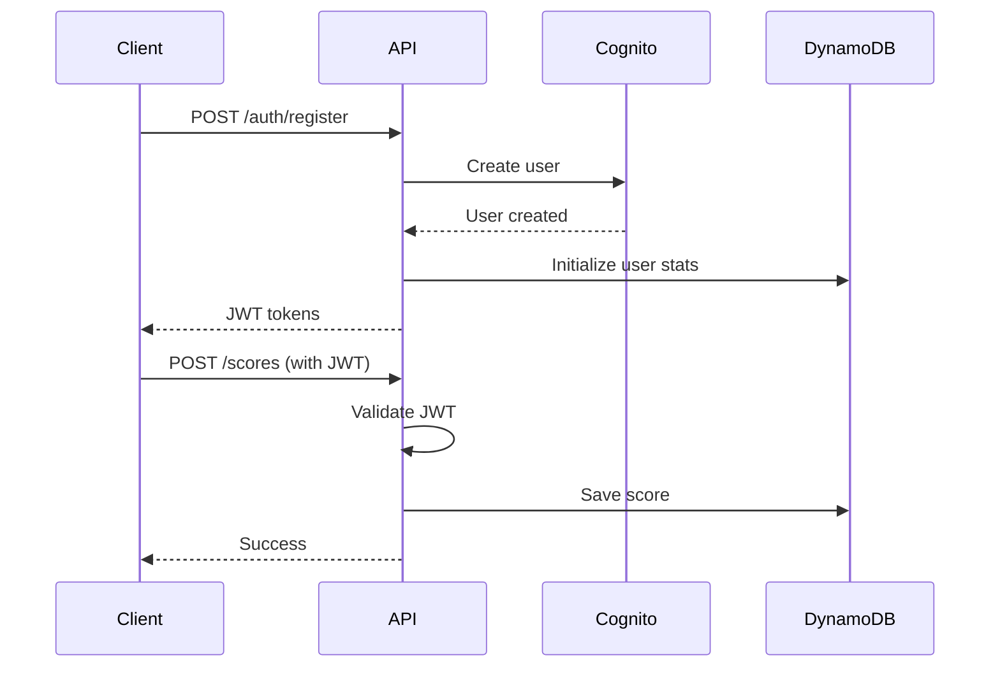

##### Middleware/Guards
```typescript
// Future auth middleware
export const authMiddleware = async (
  event: APIGatewayProxyEvent
): Promise<User | null> => {
  const token = event.headers.Authorization?.replace('Bearer ', '');
  
  if (!token) {
    return null;
  }
  
  try {
    // Verify JWT with Cognito
    const decoded = await verifyToken(token);
    return {
      id: decoded.sub,
      email: decoded.email
    };
  } catch (error) {
    return null;
  }
};
```

---

## Section 12: Unified Project Structure

Create a monorepo structure that accommodates both frontend and potential future backend:

```plaintext
river-raid-js/
├── .github/                    # CI/CD workflows
│   └── workflows/
│       ├── ci.yaml            # Test and lint
│       └── deploy.yaml        # Deploy to Vercel
├── apps/                       # Application packages
│   ├── web/                    # Frontend application
│   │   ├── src/
│   │   │   ├── game/          # Phaser game code
│   │   │   │   ├── scenes/    # Game scenes
│   │   │   │   ├── entities/  # Game objects
│   │   │   │   ├── managers/  # System managers
│   │   │   │   └── config/    # Game configuration
│   │   │   ├── ui/            # UI components
│   │   │   ├── services/      # API client (future)
│   │   │   ├── types/         # TypeScript types
│   │   │   ├── utils/         # Utilities
│   │   │   └── main.ts        # Entry point
│   │   ├── public/            # Static assets
│   │   │   ├── assets/        # Game assets
│   │   │   │   ├── sprites/   # Sprite sheets
│   │   │   │   ├── audio/     # Sound effects
│   │   │   │   └── fonts/     # Bitmap fonts
│   │   │   └── index.html     # HTML entry
│   │   ├── tests/             # Frontend tests
│   │   │   ├── unit/          # Unit tests
│   │   │   └── integration/   # Integration tests
│   │   ├── package.json       # Frontend deps
│   │   ├── tsconfig.json      # TS config
│   │   └── vite.config.ts     # Vite config
│   └── api/                    # Backend (future)
│       └── .gitkeep           # Placeholder
├── packages/                   # Shared packages
│   ├── shared/                # Shared types/utils
│   │   ├── src/
│   │   │   ├── types/         # Game interfaces
│   │   │   │   ├── entities.ts
│   │   │   │   ├── state.ts
│   │   │   │   └── index.ts
│   │   │   ├── constants/     # Game constants
│   │   │   │   ├── gameplay.ts
│   │   │   │   └── config.ts
│   │   │   └── utils/         # Shared utilities
│   │   │       └── math.ts
│   │   ├── package.json
│   │   └── tsconfig.json
│   └── config/                # Shared configuration
│       ├── eslint/            # ESLint config
│       │   └── base.js
│       ├── typescript/        # TS base config
│       │   └── base.json
│       └── jest/              # Jest config
│           └── base.js
├── infrastructure/            # IaC (future)
│   └── .gitkeep
├── scripts/                   # Build/deploy scripts
│   ├── build.sh              # Build all packages
│   └── deploy.sh             # Deploy to Vercel
├── docs/                      # Documentation
│   ├── prd.md
│   ├── front-end-spec.md
│   └── architecture.md
├── .env.example              # Environment template
├── .gitignore
├── package.json              # Root package.json
├── tsconfig.json             # Root TS config
├── README.md                 # Project readme
└── vercel.json              # Vercel config
```

---

## Section 13: Development Workflow

Define the development setup and workflow for the fullstack application.

### Local Development Setup

#### Prerequisites

```bash
# System requirements
node --version  # v18.0.0 or higher required
npm --version   # v9.0.0 or higher required

# Install Git if not present
git --version   # v2.0.0 or higher

# Optional but recommended
# VS Code with extensions:
# - ESLint
# - Prettier
# - TypeScript and JavaScript Language Features
```

#### Initial Setup

```bash
# Clone repository
git clone https://github.com/yourusername/river-raid-js.git
cd river-raid-js

# Install dependencies
npm install

# Setup git hooks (for linting)
npm run prepare

# Copy environment template
cp .env.example .env

# Verify setup
npm run check
```

#### Development Commands

```bash
# Start all services
npm run dev

# Start frontend only
npm run dev:web

# Start backend only (future)
# npm run dev:api

# Run tests
npm run test              # Run all tests
npm run test:unit        # Unit tests only
npm run test:e2e         # E2E tests only
npm run test:watch       # Watch mode

# Code quality
npm run lint             # Run ESLint
npm run lint:fix         # Fix linting issues
npm run type-check       # TypeScript validation
npm run format           # Format with Prettier

# Build commands
npm run build            # Build all packages
npm run build:web        # Build frontend only
npm run preview          # Preview production build

# Asset management
npm run assets:optimize  # Optimize sprites/audio
npm run assets:validate  # Check asset sizes
```

### Environment Configuration

#### Required Environment Variables

```bash
# Frontend (.env.local)
# Currently no environment variables required for MVP
# Future additions:
# VITE_API_URL=http://localhost:3001
# VITE_GA_ID=UA-XXXXXXXXX-X

# Backend (.env) - Future
# AWS_REGION=us-east-1
# DYNAMODB_ENDPOINT=http://localhost:8000
# JWT_SECRET=your-secret-key

# Shared
# NODE_ENV=development
# LOG_LEVEL=debug
```

### Development Workflow Best Practices

```markdown
## Daily Development Flow

1. **Start Development Server**
   ```bash
   npm run dev
   ```
   - Opens http://localhost:5173
   - Hot module replacement enabled
   - Source maps for debugging

2. **Making Changes**
   - Game logic: `apps/web/src/game/`
   - UI components: `apps/web/src/ui/`
   - Shared types: `packages/shared/src/types/`
   
3. **Testing During Development**
   ```bash
   # In another terminal
   npm run test:watch
   ```

4. **Before Committing**
   ```bash
   npm run check  # Runs lint, type-check, and tests
   ```

## Asset Development Workflow

1. **Adding Sprites**
   - Place in `apps/web/public/assets/sprites/`
   - Use PNG format with transparency
   - Keep under 1024x1024 for mobile compatibility
   - Run `npm run assets:optimize` before commit

2. **Adding Audio**
   - Place in `apps/web/public/assets/audio/`
   - Use OGG format (with MP3 fallback)
   - Keep under 100KB per sound effect
   - Normalize audio levels

3. **Asset Loading**
   - Update `src/game/config/AssetManifest.ts`
   - Add to preloader scene
   - Test loading on slow connection

## Performance Testing

```bash
# Run performance profiling
npm run perf:profile

# Check bundle size
npm run build:analyze

# Lighthouse CI (local)
npm run lighthouse
```

### Git Workflow

```bash
## Branch Strategy

main
├── develop
│   ├── feature/player-movement
│   ├── feature/enemy-ai
│   └── feature/power-ups
└── hotfix/critical-bug

## Commit Convention

# Format: <type>(<scope>): <subject>
# Types: feat, fix, docs, style, refactor, perf, test, chore

# Examples:
git commit -m "feat(player): add fuel consumption based on speed"
git commit -m "fix(collision): resolve boundary detection issue"
git commit -m "perf(render): implement object pooling for projectiles"
git commit -m "docs(readme): update development setup instructions"

## PR Process

1. Create feature branch from develop
2. Make changes with clear commits
3. Run `npm run check` locally
4. Push and create PR to develop
5. CI runs automatically
6. Merge after review
```

### Debugging Workflow

```javascript
// Debug configuration for VS Code (.vscode/launch.json)
{
  "version": "0.2.0",
  "configurations": [
    {
      "type": "chrome",
      "request": "launch",
      "name": "Launch Game",
      "url": "http://localhost:5173",
      "webRoot": "${workspaceFolder}/apps/web",
      "sourceMaps": true,
      "sourceMapPathOverrides": {
        "/@fs/*": "${workspaceFolder}/*"
      }
    },
    {
      "type": "node",
      "request": "launch",
      "name": "Debug Tests",
      "runtimeExecutable": "npm",
      "runtimeArgs": ["run", "test:debug"],
      "console": "integratedTerminal",
      "internalConsoleOptions": "neverOpen"
    }
  ]
}
```

### Hot Reload Development Tips

```typescript
// Enable Phaser debug mode in development
// In src/game/config/GameConfig.ts
export const gameConfig: Phaser.Types.Core.GameConfig = {
  // ... other config
  physics: {
    default: 'arcade',
    arcade: {
      debug: import.meta.env.DEV, // Show collision boxes in dev
      gravity: { y: 0 }
    }
  },
  // Enable FPS meter in dev
  fps: import.meta.env.DEV ? {
    target: 60,
    min: 30,
    forceSetTimeOut: true
  } : undefined
};

// Hot reload friendly scene updates
if (import.meta.hot) {
  import.meta.hot.accept('./scenes/GameScene', () => {
    // Reload scene without losing game state
    game.scene.remove('GameScene');
    game.scene.add('GameScene', GameScene);
  });
}
```

---

## Section 14: Deployment Architecture

Define deployment strategy based on platform choice.

### Deployment Strategy

**Frontend Deployment:**
- **Platform:** Vercel
- **Build Command:** `npm run build`
- **Output Directory:** `apps/web/dist`
- **CDN/Edge:** Vercel Edge Network (automatic global distribution)

**Backend Deployment:**
- **Platform:** N/A (Client-side only for MVP)
- **Build Command:** N/A
- **Deployment Method:** N/A

**Asset Optimization:**
- Sprites compressed via build pipeline
- JavaScript bundles minified and tree-shaken
- Automatic code splitting for optimal loading
- Brotli compression on Vercel Edge

### CI/CD Pipeline

```yaml
# .github/workflows/deploy.yaml
name: Deploy to Production

on:
  push:
    branches: [main]
  pull_request:
    branches: [main]

jobs:
  test:
    runs-on: ubuntu-latest
    steps:
      - uses: actions/checkout@v4
      
      - name: Setup Node.js
        uses: actions/setup-node@v4
        with:
          node-version: '18'
          cache: 'npm'
      
      - name: Install dependencies
        run: npm ci
      
      - name: Run linting
        run: npm run lint
      
      - name: Run type checking
        run: npm run type-check
      
      - name: Run unit tests
        run: npm run test:unit
      
      - name: Build application
        run: npm run build
      
      - name: Run E2E tests
        run: |
          npm run preview &
          sleep 5
          npm run test:e2e
      
      - name: Check bundle size
        run: |
          npm run build:analyze
          # Fail if main bundle > 1MB
          if [ $(stat -f%z apps/web/dist/assets/*.js | head -1) -gt 1048576 ]; then
            echo "Bundle size exceeds 1MB limit!"
            exit 1
          fi

  deploy:
    needs: test
    runs-on: ubuntu-latest
    if: github.ref == 'refs/heads/main'
    
    steps:
      - uses: actions/checkout@v4
      
      - name: Deploy to Vercel
        uses: amondnet/vercel-action@v25
        with:
          vercel-token: ${{ secrets.VERCEL_TOKEN }}
          vercel-org-id: ${{ secrets.VERCEL_ORG_ID }}
          vercel-project-id: ${{ secrets.VERCEL_PROJECT_ID }}
          vercel-args: '--prod'

  lighthouse:
    needs: deploy
    runs-on: ubuntu-latest
    if: github.ref == 'refs/heads/main'
    
    steps:
      - uses: actions/checkout@v4
      
      - name: Run Lighthouse CI
        uses: treosh/lighthouse-ci-action@v11
        with:
          urls: |
            https://river-raid-js.vercel.app
          uploadArtifacts: true
          temporaryPublicStorage: true
          # Performance thresholds
          configPath: './lighthouse.config.js'
```

```yaml
# .github/workflows/preview.yaml
name: Preview Deployment

on:
  pull_request:
    types: [opened, synchronize, reopened]

jobs:
  deploy-preview:
    runs-on: ubuntu-latest
    steps:
      - uses: actions/checkout@v4
      
      - name: Deploy Preview to Vercel
        uses: amondnet/vercel-action@v25
        with:
          vercel-token: ${{ secrets.VERCEL_TOKEN }}
          vercel-org-id: ${{ secrets.VERCEL_ORG_ID }}
          vercel-project-id: ${{ secrets.VERCEL_PROJECT_ID }}
          github-token: ${{ secrets.GITHUB_TOKEN }}
          github-comment: true
```

### Environments

| Environment | Frontend URL | Backend URL | Purpose |
|-------------|--------------|-------------|---------|
| Development | http://localhost:5173 | N/A | Local development |
| Preview | https://river-raid-js-pr-*.vercel.app | N/A | PR preview deployments |
| Staging | https://river-raid-js-staging.vercel.app | N/A | Pre-production testing |
| Production | https://river-raid-js.vercel.app | N/A | Live environment |

### Vercel Configuration

```json
// vercel.json
{
  "version": 2,
  "builds": [
    {
      "src": "apps/web/package.json",
      "use": "@vercel/static-build",
      "config": {
        "distDir": "apps/web/dist"
      }
    }
  ],
  "routes": [
    {
      "src": "/assets/(.*)",
      "headers": {
        "Cache-Control": "public, max-age=31536000, immutable"
      }
    },
    {
      "src": "/(.*)",
      "headers": {
        "X-Frame-Options": "DENY",
        "X-Content-Type-Options": "nosniff",
        "X-XSS-Protection": "1; mode=block",
        "Referrer-Policy": "strict-origin-when-cross-origin"
      }
    }
  ],
  "github": {
    "enabled": true,
    "autoAlias": true
  }
}
```

### Performance Budget Configuration

```javascript
// lighthouse.config.js
module.exports = {
  ci: {
    collect: {
      staticDistDir: './apps/web/dist',
      numberOfRuns: 3,
    },
    assert: {
      assertions: {
        'categories:performance': ['error', { minScore: 0.9 }],
        'categories:accessibility': ['warn', { minScore: 0.9 }],
        'categories:best-practices': ['error', { minScore: 0.95 }],
        'categories:seo': ['warn', { minScore: 0.9 }],
        'first-contentful-paint': ['error', { maxNumericValue: 2000 }],
        'speed-index': ['error', { maxNumericValue: 3000 }],
        'largest-contentful-paint': ['error', { maxNumericValue: 2500 }],
        'interactive': ['error', { maxNumericValue: 3500 }],
        'total-blocking-time': ['error', { maxNumericValue: 300 }],
        'cumulative-layout-shift': ['error', { maxNumericValue: 0.1 }],
        'max-potential-fid': ['error', { maxNumericValue: 130 }],
        'resource-summary:script:size': ['error', { maxNumericValue: 350000 }],
        'resource-summary:total:size': ['error', { maxNumericValue: 1000000 }],
      },
    },
    upload: {
      target: 'temporary-public-storage',
    },
  },
};
```

### Deployment Checklist

```markdown
## Pre-Deployment Checklist

- [ ] All tests passing locally (`npm run check`)
- [ ] Bundle size under 1MB
- [ ] No console.log statements in production code
- [ ] Environment variables documented
- [ ] Asset optimization completed
- [ ] Performance budget met (Lighthouse > 90)
- [ ] Cross-browser testing completed
- [ ] Mobile responsiveness verified

## Post-Deployment Verification

- [ ] Game loads within 2 seconds
- [ ] 60 FPS maintained during gameplay
- [ ] Touch controls work on mobile
- [ ] No JavaScript errors in console
- [ ] Analytics tracking (if configured)
- [ ] CDN cache headers correct
```

---

## Section 15: Security and Performance

Define security and performance considerations for the fullstack application.

### Security Requirements

**Frontend Security:**
- CSP Headers: `default-src 'self'; script-src 'self' 'unsafe-inline'; style-src 'self' 'unsafe-inline'; img-src 'self' data: blob:; font-src 'self'; connect-src 'self'`
- XSS Prevention: All user inputs sanitized (future features), no innerHTML usage
- Secure Storage: High scores in localStorage only, no sensitive data stored

**Backend Security (Future):**
- Input Validation: Zod schema validation for all API inputs
- Rate Limiting: 100 requests per minute per IP
- CORS Policy: Strict origin checking, credentials not included

**Authentication Security (Future):**
- Token Storage: httpOnly cookies for refresh tokens, memory for access tokens
- Session Management: 15-minute access token, 7-day refresh token
- Password Policy: Minimum 8 characters, complexity not required for game

**Client-Side Security Measures:**
```typescript
// Anti-cheat measures for client-side high scores
class SecurityManager {
  private gameStartTime: number = 0;
  private actionLog: Array<{action: string, timestamp: number}> = [];
  
  // Validate score is achievable
  validateScore(score: number, gameTime: number): boolean {
    // Check minimum time per point (prevents instant high scores)
    const minTimePerPoint = 0.5; // seconds
    const minRequiredTime = score * minTimePerPoint;
    
    if (gameTime < minRequiredTime) {
      console.warn('Suspicious score detected');
      return false;
    }
    
    // Check action frequency (prevents automated play)
    const actionsPerSecond = this.actionLog.length / gameTime;
    if (actionsPerSecond > 15) { // Human limit ~10-12 actions/second
      console.warn('Suspicious action rate detected');
      return false;
    }
    
    return true;
  }
  
  // Obfuscate score storage
  encodeScore(score: number): string {
    // Simple obfuscation (not cryptographically secure)
    const encoded = btoa(JSON.stringify({
      s: score,
      t: Date.now(),
      h: this.generateChecksum(score)
    }));
    return encoded;
  }
  
  private generateChecksum(score: number): string {
    // Simple checksum to detect tampering
    return btoa(score.toString() + '-river-raid-2025');
  }
}
```

### Performance Optimization

**Frontend Performance:**
- Bundle Size Target: < 1MB total (including Phaser)
- Loading Strategy: Progressive loading with visible progress
- Caching Strategy: Aggressive caching for all game assets (1 year), versioned URLs for updates

**Backend Performance (Future):**
- Response Time Target: < 100ms for API calls
- Database Optimization: DynamoDB with proper indexes
- Caching Strategy: CloudFront for static assets, no server-side caching needed

**Performance Implementation:**

```typescript
// Asset loading optimization
class PerformanceOptimizedLoader {
  private loadingPriorities = {
    critical: ['player_sprite', 'ui_elements'],
    high: ['enemy_sprites', 'fuel_depot'],
    low: ['background_music', 'particle_effects']
  };
  
  async loadAssets(scene: Phaser.Scene): Promise<void> {
    // Load critical assets first
    await this.loadAssetGroup(scene, this.loadingPriorities.critical);
    
    // Signal game can start with critical assets
    scene.events.emit('criticalAssetsLoaded');
    
    // Load remaining assets in background
    await Promise.all([
      this.loadAssetGroup(scene, this.loadingPriorities.high),
      this.loadAssetGroup(scene, this.loadingPriorities.low)
    ]);
  }
  
  private async loadAssetGroup(
    scene: Phaser.Scene, 
    assets: string[]
  ): Promise<void> {
    // Implementation with progress tracking
  }
}

// Frame rate optimization
class RenderOptimizer {
  private renderDistance = 1200; // Pixels beyond viewport
  private cullInvisible = true;
  
  optimizeScene(scene: Phaser.Scene): void {
    // Frustum culling
    scene.cameras.main.on('cameramove', () => {
      const bounds = scene.cameras.main.worldView;
      
      scene.children.list.forEach(child => {
        if ('body' in child) {
          const inView = Phaser.Geom.Rectangle.Overlaps(
            bounds,
            child.getBounds()
          );
          child.setVisible(inView);
          if ('body' in child && child.body) {
            child.body.enable = inView;
          }
        }
      });
    });
  }
}

// Memory management
class MemoryManager {
  private pools: Map<string, Phaser.GameObjects.Group> = new Map();
  
  createPool(
    scene: Phaser.Scene,
    key: string,
    config: Phaser.Types.GameObjects.Group.GroupConfig
  ): void {
    const pool = scene.add.group({
      ...config,
      runChildUpdate: false, // Disable until needed
      createCallback: (item) => {
        item.setActive(false).setVisible(false);
      },
      removeCallback: (item) => {
        item.setActive(false).setVisible(false);
      }
    });
    
    this.pools.set(key, pool);
  }
  
  // Periodic cleanup of unused objects
  cleanupPools(): void {
    this.pools.forEach(pool => {
      const inactive = pool.getChildren().filter(
        child => !child.active && !child.visible
      );
      // Keep max 50 inactive objects per pool
      if (inactive.length > 50) {
        inactive.slice(50).forEach(child => child.destroy());
      }
    });
  }
}
```

### Performance Monitoring

```typescript
// Real-time performance tracking
class PerformanceMonitor {
  private metrics = {
    fps: [] as number[],
    frameTime: [] as number[],
    heapUsed: [] as number[],
  };
  
  startMonitoring(game: Phaser.Game): void {
    // FPS tracking
    game.events.on('prestep', () => {
      this.metrics.fps.push(game.loop.actualFps);
      
      // Keep last 60 samples (1 second at 60 FPS)
      if (this.metrics.fps.length > 60) {
        this.metrics.fps.shift();
      }
      
      // Alert if FPS drops below threshold
      const avgFps = this.getAverageFps();
      if (avgFps < 50 && avgFps > 0) {
        console.warn(`Performance warning: FPS dropped to ${avgFps}`);
        this.degradeQuality(game);
      }
    });
    
    // Memory tracking
    if (performance.memory) {
      setInterval(() => {
        this.metrics.heapUsed.push(performance.memory.usedJSHeapSize);
        
        // Alert if memory usage is high
        if (performance.memory.usedJSHeapSize > 100 * 1024 * 1024) {
          console.warn('High memory usage detected');
          this.triggerGarbageCollection(game);
        }
      }, 1000);
    }
  }
  
  private getAverageFps(): number {
    const sum = this.metrics.fps.reduce((a, b) => a + b, 0);
    return Math.round(sum / this.metrics.fps.length);
  }
  
  private degradeQuality(game: Phaser.Game): void {
    // Reduce particle effects
    // Decrease render distance
    // Simplify shaders
  }
  
  private triggerGarbageCollection(game: Phaser.Game): void {
    // Clean up object pools
    // Clear unused textures
    // Force scene cleanup
  }
}
```

### Web Performance Optimizations

```javascript
// vite.config.ts performance optimizations
export default defineConfig({
  build: {
    rollupOptions: {
      output: {
        manualChunks: {
          'phaser': ['phaser'],
          'game': ['./src/game/index.ts'],
          'ui': ['./src/ui/index.ts']
        },
        assetFileNames: 'assets/[name]-[hash][extname]',
        chunkFileNames: 'js/[name]-[hash].js',
        entryFileNames: 'js/[name]-[hash].js'
      }
    },
    terserOptions: {
      compress: {
        drop_console: true,
        drop_debugger: true,
        pure_funcs: ['console.log', 'console.info']
      }
    },
    reportCompressedSize: false, // Faster builds
    chunkSizeWarningLimit: 1000 // 1MB warning
  },
  optimizeDeps: {
    include: ['phaser'] // Pre-bundle heavy dependencies
  }
});
```

---

## Section 16: Testing Strategy

Define comprehensive testing approach for fullstack application.

### Testing Pyramid

```text
         E2E Tests (10%)
        /              \
    Integration Tests (30%)
   /                      \
Unit Tests (60%)    Performance Tests
```

**Distribution Rationale:**
- Heavy focus on unit tests for game logic (collision, physics, scoring)
- Integration tests for component interactions (input→entity→physics)
- Minimal E2E for critical user journeys (start→play→game over)
- Performance tests to ensure 60 FPS requirement

### Test Organization

#### Frontend Tests

```text
apps/web/tests/
├── unit/
│   ├── game/
│   │   ├── entities/
│   │   │   ├── Player.test.ts
│   │   │   ├── Enemy.test.ts
│   │   │   └── Projectile.test.ts
│   │   ├── managers/
│   │   │   ├── StateManager.test.ts
│   │   │   ├── PhysicsManager.test.ts
│   │   │   └── EntityManager.test.ts
│   │   ├── generators/
│   │   │   └── RiverGenerator.test.ts
│   │   └── utils/
│   │       ├── ObjectPool.test.ts
│   │       └── MathUtils.test.ts
│   ├── ui/
│   │   ├── HUD.test.ts
│   │   └── TouchControls.test.ts
│   └── services/
│       └── AudioService.test.ts
├── integration/
│   ├── game-flow.test.ts
│   ├── collision-system.test.ts
│   ├── input-handling.test.ts
│   └── score-system.test.ts
├── e2e/
│   ├── gameplay.spec.ts
│   ├── mobile-controls.spec.ts
│   └── performance.spec.ts
├── performance/
│   ├── frame-rate.test.ts
│   ├── memory-usage.test.ts
│   └── load-time.test.ts
└── fixtures/
    ├── mockAssets.ts
    ├── testHelpers.ts
    └── gameStates.ts
```

#### Backend Tests (Future)

```text
apps/api/tests/
├── unit/
│   ├── validators/
│   │   └── scoreValidator.test.ts
│   ├── services/
│   │   └── leaderboardService.test.ts
│   └── utils/
│       └── auth.test.ts
├── integration/
│   ├── api/
│   │   └── scores.test.ts
│   └── database/
│       └── dynamo.test.ts
└── fixtures/
    └── testData.ts
```

#### E2E Tests

```text
e2e/
├── specs/
│   ├── critical-path.spec.ts
│   ├── game-mechanics.spec.ts
│   └── cross-browser.spec.ts
├── support/
│   ├── commands.ts
│   └── helpers.ts
└── config/
    └── playwright.config.ts
```

### Test Examples

#### Frontend Component Test

```typescript
// apps/web/tests/unit/game/entities/Player.test.ts
import { describe, it, expect, beforeEach, vi } from 'vitest';
import { Player } from '@/game/entities/Player';
import { createMockScene } from '@/tests/fixtures/mockScene';

describe('Player Entity', () => {
  let player: Player;
  let mockScene: any;

  beforeEach(() => {
    mockScene = createMockScene();
    player = new Player(mockScene, 400, 500);
  });

  describe('Fuel Management', () => {
    it('should decrease fuel over time', () => {
      const initialFuel = player.fuel;
      player.update(1000); // 1 second
      
      expect(player.fuel).toBeLessThan(initialFuel);
      expect(player.fuel).toBeGreaterThan(0);
    });

    it('should calculate max speed based on fuel percentage', () => {
      player.fuel = 100;
      expect(player.maxSpeed).toBe(300);
      
      player.fuel = 50;
      player.update(0);
      expect(player.maxSpeed).toBe(150);
      
      player.fuel = 0;
      player.update(0);
      expect(player.maxSpeed).toBe(0);
    });

    it('should die when fuel reaches zero', () => {
      player.fuel = 0.1;
      player.update(100);
      
      expect(player.fuel).toBe(0);
      expect(player.isAlive).toBe(false);
    });
  });
});
```

#### Integration Test

```typescript
// apps/web/tests/integration/collision-system.test.ts
import { describe, it, expect, beforeEach } from 'vitest';
import { PhysicsManager } from '@/game/managers/PhysicsManager';
import { EntityManager } from '@/game/managers/EntityManager';
import { StateManager } from '@/game/managers/StateManager';
import { createMockScene } from '@/tests/fixtures/mockScene';

describe('Collision System Integration', () => {
  let physicsManager: PhysicsManager;
  let entityManager: EntityManager;
  let stateManager: StateManager;
  let mockScene: any;

  beforeEach(() => {
    mockScene = createMockScene();
    stateManager = new StateManager();
    entityManager = new EntityManager(mockScene);
    physicsManager = new PhysicsManager(mockScene, entityManager);
  });

  it('should handle player-enemy collision', () => {
    const player = entityManager.createPlayer(400, 500);
    const enemy = entityManager.spawnEnemy('ship', 400, 500);
    
    // Register collision handlers
    physicsManager.setupCollisions(stateManager);
    
    // Simulate collision
    physicsManager.checkCollision(player, enemy);
    
    expect(player.isAlive).toBe(false);
    expect(stateManager.getCurrentState()).toBe('GAME_OVER');
  });
});
```

#### E2E Test

```typescript
// e2e/specs/gameplay.spec.ts
import { test, expect, Page } from '@playwright/test';

test.describe('River Raid Gameplay', () => {
  let page: Page;

  test.beforeEach(async ({ page: testPage }) => {
    page = testPage;
    await page.goto('/');
    await page.click('text=CLICK TO START');
    await page.waitForTimeout(500); // Wait for game initialization
  });

  test('should complete a basic game session', async () => {
    // Verify game started
    await expect(page.locator('#game-canvas')).toBeVisible();
    await expect(page.locator('.hud-score')).toContainText('SCORE: 0');
    
    // Test shooting
    await page.keyboard.press('Space');
    await page.waitForTimeout(100);
    
    // Move player
    await page.keyboard.down('ArrowLeft');
    await page.waitForTimeout(500);
    await page.keyboard.up('ArrowLeft');
  });
});
```

#### Performance Test

```typescript
// apps/web/tests/performance/frame-rate.test.ts
import { describe, it, expect } from 'vitest';
import { performanceTest } from '@/tests/fixtures/performanceHelpers';

describe('Frame Rate Performance', () => {
  it('should maintain 60 FPS with 50 enemies on screen', async () => {
    const result = await performanceTest(async (game) => {
      const scene = game.scene.scenes[0];
      
      // Spawn many enemies
      for (let i = 0; i < 50; i++) {
        scene.entityManager.spawnEnemy('ship', 
          Math.random() * 800, 
          Math.random() * 600
        );
      }
      
      // Measure FPS over 1000 frames
      const fpsReadings: number[] = [];
      for (let frame = 0; frame < 1000; frame++) {
        await new Promise(resolve => requestAnimationFrame(resolve));
        fpsReadings.push(game.loop.actualFps);
      }
      
      return {
        avgFps: fpsReadings.reduce((a, b) => a + b) / fpsReadings.length
      };
    });
    
    expect(result.avgFps).toBeGreaterThan(58);
  });
});
```

### Testing Best Practices

```typescript
// Test utilities and helpers
// apps/web/tests/fixtures/testHelpers.ts

export const createMockScene = () => {
  return {
    add: {
      existing: vi.fn(),
      group: vi.fn(() => ({
        create: vi.fn(),
        getChildren: vi.fn(() => []),
        clear: vi.fn()
      }))
    },
    physics: {
      add: {
        existing: vi.fn(),
        collider: vi.fn(),
        overlap: vi.fn()
      }
    }
  };
};

// Performance test harness
export const performanceTest = async (
  testFn: (game: Phaser.Game) => Promise<any>
) => {
  const config = { type: Phaser.HEADLESS };
  const game = new Phaser.Game(config);
  try {
    return await testFn(game);
  } finally {
    game.destroy(true, false);
  }
};
```

### CI Test Configuration

```yaml
# vitest.config.ts
import { defineConfig } from 'vitest/config';

export default defineConfig({
  test: {
    globals: true,
    environment: 'jsdom',
    setupFiles: ['./tests/setup.ts'],
    coverage: {
      provider: 'v8',
      reporter: ['text', 'json', 'html'],
      thresholds: {
        lines: 80,
        functions: 80,
        branches: 70,
        statements: 80
      }
    }
  }
});
```

---

## Section 17: Coding Standards

Define MINIMAL but CRITICAL standards for AI agents. Focus only on project-specific rules that prevent common mistakes. These will be used by dev agents.

### Critical Fullstack Rules

- **Type Sharing:** Always define types in packages/shared/src/types and import from '@shared/types'
- **Asset References:** Never hardcode asset paths - use AssetManifest.ts constants only
- **Game State Access:** Never access game state directly - always go through StateManager
- **Object Creation:** Never create game objects with `new` during gameplay - always use EntityManager pools
- **Physics Updates:** Never modify position/velocity directly - use Phaser physics API
- **Event Handling:** Always cleanup event listeners in destroy() methods to prevent memory leaks
- **Frame-Dependent Logic:** Never use raw delta time - use Phaser's built-in time.delta
- **Browser APIs:** Never use setTimeout/setInterval - use Phaser's time events
- **Local Storage:** Access only through SecurityManager for score encoding/validation

### Naming Conventions

| Element | Frontend | Backend | Example |
|---------|----------|---------|---------|
| Components | PascalCase | - | `PlayerJet.ts`, `EnemyShip.ts` |
| Game Scenes | PascalCase with 'Scene' suffix | - | `GameScene.ts`, `StartScene.ts` |
| Managers | PascalCase with 'Manager' suffix | - | `InputManager.ts`, `StateManager.ts` |
| Event Names | SCREAMING_SNAKE_CASE | - | `PLAYER_DIED`, `SCORE_UPDATED` |
| Asset Keys | snake_case | - | `player_sprite`, `explosion_sound` |
| Constants | SCREAMING_SNAKE_CASE | - | `MAX_ENEMIES`, `FUEL_DRAIN_RATE` |
| Methods | camelCase | - | `spawnEnemy()`, `updateScore()` |
| Phaser Config | camelCase | - | `gameConfig`, `physicsConfig` |

### Game-Specific Coding Patterns

```typescript
// ❌ WRONG: Direct state mutation
this.score += points;

// ✅ CORRECT: Through manager with events
this.stateManager.updateScore(points);

// ❌ WRONG: Creating objects during gameplay
const enemy = new Enemy(this.scene, x, y);

// ✅ CORRECT: Using object pools
const enemy = this.entityManager.spawnEnemy(type, x, y);

// ❌ WRONG: Frame-dependent without delta
this.x += this.speed;

// ✅ CORRECT: Delta-time based movement
this.x += this.speed * (delta / 1000);
```

---

## Section 18: Error Handling Strategy

Define unified error handling across frontend and backend.

### Error Flow

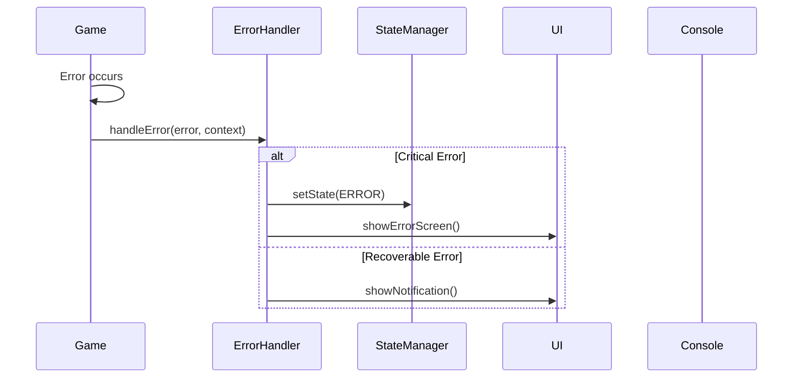

### Error Response Format

```typescript
interface GameError {
  error: {
    code: string;
    message: string;
    details?: Record<string, any>;
    timestamp: string;
    context: {
      scene: string;
      gameTime: number;
    };
    severity: 'critical' | 'warning' | 'info';
    recoverable: boolean;
  };
}
```

### Frontend Error Handling

```typescript
// Error handler service
export class ErrorHandler {
  handleError(error: Error, context: any, severity: string = 'warning') {
    // ... implementation
  }

  private handleCriticalError(error: GameError) {
    // Stop game and show error screen
  }
}

// Scene-level error boundary
export class ErrorBoundaryScene extends Phaser.Scene {
  create() {
    try {
      // ... scene setup
    } catch (error) {
      // handle error
    }
  }
}
```

---

## Section 19: Monitoring and Observability

Define monitoring strategy for fullstack application.

### Monitoring Stack

- **Frontend Monitoring:** Vercel Analytics (basic free tier) + Custom performance tracking
- **Backend Monitoring:** N/A for MVP (future: AWS CloudWatch)
- **Error Tracking:** Custom error handler with local logging (future: Sentry)
- **Performance Monitoring:** Built-in FPS meter + custom metrics collection

### Key Metrics

**Frontend Metrics:**
- Core Web Vitals (LCP, FID, CLS)
- JavaScript errors and stack traces
- Game-specific: FPS, frame drops, input latency
- Memory usage patterns
- User interactions (start, play, game over)

**Backend Metrics (Future):**
- Request rate
- Error rate
- Response time

### Implementation

```typescript
// Performance monitoring service
export class MonitoringService {
  initialize() {
    this.setupPerformanceObserver();
    this.setupGameMetrics();
    this.setupErrorTracking();
  }

  // Game-specific metrics
  trackGameSession(data: any) {
    // ... implementation
  }
}

// Development dashboard
export class MonitoringDashboard {
  show() {
    // ... creates and updates a DOM element with metrics
  }
}
```

---

## Section 20: Checklist Results Report

This section will be populated after the architect checklist has been executed against this document.
