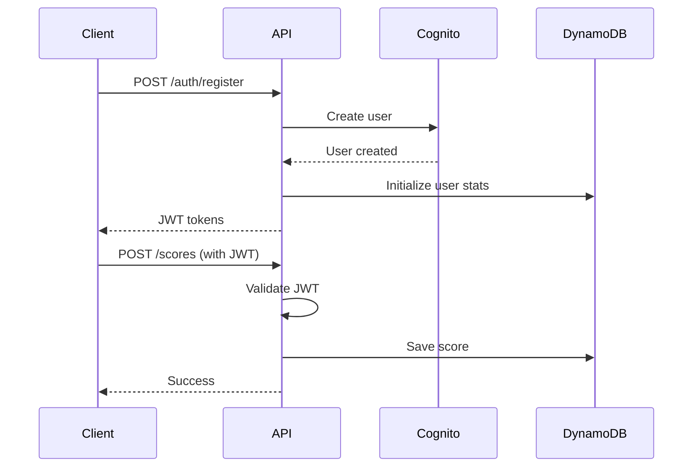

# Section 11: Backend Architecture

### Current State: N/A - Client-side only application

River Raid JS MVP requires no backend services. All game logic, state management, and data persistence (high scores) are handled client-side using browser localStorage.

### Future Backend Architecture Considerations

When backend services are eventually needed for features like leaderboards, user accounts, or multiplayer, here's the proposed architecture:

#### Service Architecture

##### Serverless Architecture (Recommended for Future)

###### Function Organization
```text
backend/
├── functions/
│   ├── auth/
│   │   ├── login.ts
│   │   ├── register.ts
│   │   └── refresh.ts
│   ├── scores/
│   │   ├── submit.ts
│   │   ├── getLeaderboard.ts
│   │   └── getUserScores.ts
│   ├── stats/
│   │   ├── updateStats.ts
│   │   └── getStats.ts
│   └── shared/
│       ├── middleware/
│       │   ├── auth.ts
│       │   └── rateLimit.ts
│       └── utils/
│           └── validation.ts
├── infrastructure/
│   └── serverless.yml
└── package.json
```

###### Function Template
```typescript
// Example serverless function - submitScore.ts
import { APIGatewayProxyHandler } from 'aws-lambda';
import { DynamoDB } from 'aws-sdk';
import { authenticate } from '../shared/middleware/auth';
import { validateScore } from '../shared/utils/validation';

const dynamodb = new DynamoDB.DocumentClient();

export const handler: APIGatewayProxyHandler = async (event) => {
  try {
    // Authenticate user
    const user = await authenticate(event.headers.Authorization);
    
    // Validate score data
    const scoreData = JSON.parse(event.body || '{}');
    if (!validateScore(scoreData)) {
      return {
        statusCode: 400,
        body: JSON.stringify({ error: 'Invalid score data' })
      };
    }
    
    // Save to DynamoDB
    await dynamodb.put({
      TableName: process.env.SCORES_TABLE!,
      Item: {
        userId: user.id,
        timestamp: Date.now(),
        ...scoreData
      }
    }).promise();
    
    return {
      statusCode: 200,
      body: JSON.stringify({ success: true })
    };
  } catch (error) {
    return {
      statusCode: 500,
      body: JSON.stringify({ error: 'Internal server error' })
    };
  }
};
```

#### Database Architecture

##### Schema Design (Future DynamoDB)
```typescript
// DynamoDB table designs for serverless architecture

// Scores table
{
  TableName: "RiverRaidScores",
  PartitionKey: "userId",        // For user-specific queries
  SortKey: "timestamp",           // For chronological ordering
  GlobalSecondaryIndex: {
    name: "ScoreIndex",
    PartitionKey: "gameVersion",
    SortKey: "score"              // For leaderboard queries
  }
}

// Users table  
{
  TableName: "RiverRaidUsers",
  PartitionKey: "userId",
  Attributes: {
    email: "string",
    username: "string",
    createdAt: "number",
    stats: {
      totalGames: "number",
      highScore: "number",
      totalPlayTime: "number"
    }
  }
}
```

##### Data Access Layer (Future)
```typescript
// Repository pattern for data access
export class ScoreRepository {
  private dynamodb: DynamoDB.DocumentClient;
  
  constructor() {
    this.dynamodb = new DynamoDB.DocumentClient();
  }
  
  async saveScore(userId: string, score: ScoreData): Promise<void> {
    await this.dynamodb.put({
      TableName: process.env.SCORES_TABLE!,
      Item: {
        userId,
        timestamp: Date.now(),
        ...score
      }
    }).promise();
  }
  
  async getTopScores(limit: number = 10): Promise<Score[]> {
    const result = await this.dynamodb.query({
      TableName: process.env.SCORES_TABLE!,
      IndexName: 'ScoreIndex',
      KeyConditionExpression: 'gameVersion = :version',
      ExpressionAttributeValues: {
        ':version': '1.0.0'
      },
      ScanIndexForward: false,
      Limit: limit
    }).promise();
    
    return result.Items as Score[];
  }
}
```

#### Authentication and Authorization (Future)

##### Auth Flow


##### Middleware/Guards
```typescript
// Future auth middleware
export const authMiddleware = async (
  event: APIGatewayProxyEvent
): Promise<User | null> => {
  const token = event.headers.Authorization?.replace('Bearer ', '');
  
  if (!token) {
    return null;
  }
  
  try {
    // Verify JWT with Cognito
    const decoded = await verifyToken(token);
    return {
      id: decoded.sub,
      email: decoded.email
    };
  } catch (error) {
    return null;
  }
};
```

---

