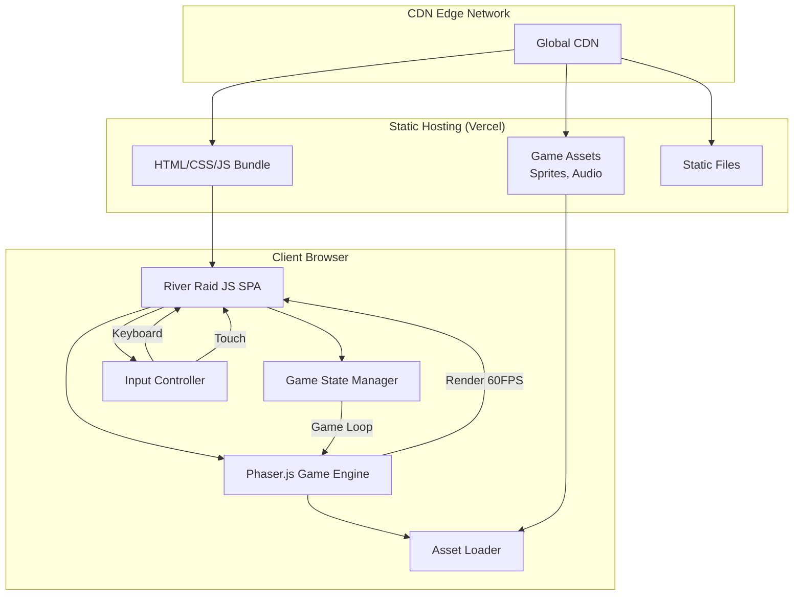

# Section 2: High Level Architecture

### Technical Summary

River Raid JS is a client-side single-page application (SPA) built as a browser-based arcade game using modern JavaScript and a 2D game rendering engine. The architecture employs a component-based game object system with Phaser.js for rendering and physics, deployed as static assets to a CDN-backed hosting platform. The game requires no backend services for MVP, maintaining all game state client-side with a focus on achieving consistent 60 FPS performance across desktop and mobile browsers. This architecture delivers on the PRD's vision of an instantly accessible, high-performance web game that faithfully recreates the classic River Raid experience with modern enhancements.

### Platform and Infrastructure Choice

Based on the PRD requirements for zero-cost deployment and client-side only architecture, here are the viable platform options:

**Option 1: Vercel (Recommended)**
- **Pros**: Excellent performance, automatic HTTPS, global CDN, great DX, generous free tier
- **Cons**: Overkill for static site, but no real downsides for this use case

**Option 2: GitHub Pages**
- **Pros**: Completely free, integrated with Git workflow, simple deployment
- **Cons**: Limited to 100GB bandwidth/month, no custom headers, basic CDN

**Option 3: Netlify**
- **Pros**: Good free tier, form handling (future use), serverless functions (future expansion)
- **Cons**: 100GB bandwidth limit on free tier

**Recommendation**: Vercel for its superior performance and developer experience, crucial for a 60 FPS game.

**Platform:** Vercel  
**Key Services:** Static hosting, Edge network CDN, Automatic HTTPS, Analytics (basic)  
**Deployment Host and Regions:** Global edge network (automatic region selection based on user location)

### Repository Structure

Given the project's scope and single-developer nature specified in the PRD, a simple monorepo structure is optimal:

**Structure:** Monorepo  
**Monorepo Tool:** None required (npm workspaces if future backend added)  
**Package Organization:** Single package for now, prepared for expansion with logical separation of game engine, assets, and UI code

### High Level Architecture Diagram

### Architectural Patterns

- **Component-Entity System:** Game objects (jet, enemies, fuel) as composable entities with behavior components - _Rationale:_ Enables clean separation of concerns and easy addition of new game objects
- **State Machine Pattern:** Explicit game states (Start, Playing, GameOver) with clear transitions - _Rationale:_ Prevents invalid state transitions and simplifies game flow logic
- **Observer Pattern:** Event-driven communication between game systems (collision, scoring, fuel) - _Rationale:_ Decouples game systems allowing independent testing and modification
- **Object Pool Pattern:** Reusable pools for bullets, enemies, and particles - _Rationale:_ Critical for maintaining 60 FPS by avoiding garbage collection during gameplay
- **Module Pattern:** ES6 modules for code organization and encapsulation - _Rationale:_ Native browser support, tree-shaking for optimal bundle size
- **Singleton Pattern:** Single instances for Game Manager, Asset Manager, Input Manager - _Rationale:_ Ensures single source of truth for critical game systems
- **Static Site Generation:** Pre-built assets served directly from CDN - _Rationale:_ Optimal performance and zero server costs as required by PRD

---

