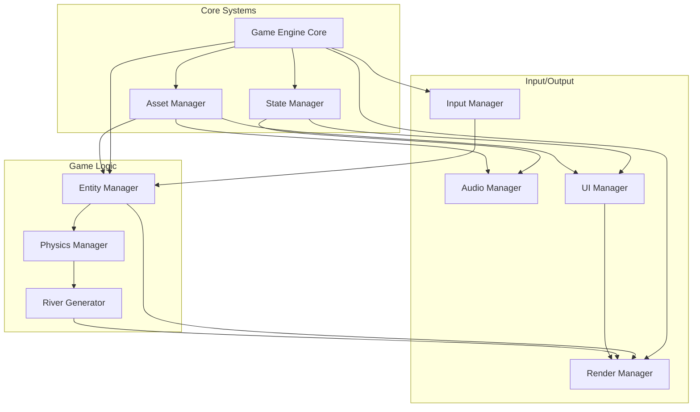

# Section 6: Components

Based on the architectural patterns, tech stack, and data models defined above, here are the major logical components across the application:

### Game Engine Core

**Responsibility:** Initializes Phaser, manages the game loop, coordinates all subsystems, and handles scene transitions

**Key Interfaces:**
- `init()`: Initialize Phaser with game configuration
- `start()`: Begin game loop
- `pause()`: Pause game execution
- `resume()`: Resume from pause
- `destroy()`: Clean up resources

**Dependencies:** Phaser.js framework, all manager components

**Technology Stack:** Phaser 3.70.0 with WebGL/Canvas rendering

### Input Manager

**Responsibility:** Abstracts input handling across keyboard and touch, providing unified control events

**Key Interfaces:**
- `onMove(callback)`: Register movement handler
- `onFire(callback)`: Register fire action handler
- `onBomb(callback)`: Register bomb action handler
- `getInputState()`: Get current input state
- `enableTouch()`: Enable mobile touch controls

**Dependencies:** Game Engine Core

**Technology Stack:** Phaser Input API with custom touch overlay implementation

### Entity Manager

**Responsibility:** Manages lifecycle of all game entities (player, enemies, projectiles, fuel depots) using object pooling

**Key Interfaces:**
- `spawnEnemy(type, position)`: Create enemy from pool
- `spawnProjectile(position, velocity)`: Create projectile
- `spawnFuelDepot(position)`: Create fuel depot
- `recycleEntity(entity)`: Return to pool
- `updateAll(deltaTime)`: Update all active entities

**Dependencies:** Object pools, Physics Manager

**Technology Stack:** Custom object pooling system with Phaser GameObjects

### Physics Manager

**Responsibility:** Handles collision detection between all game entities and river boundaries

**Key Interfaces:**
- `checkCollisions()`: Detect all collisions this frame
- `registerCollisionHandler(typeA, typeB, handler)`: Set collision callbacks
- `updateBoundaries(boundaries)`: Update river collision boundaries
- `isInBounds(entity)`: Check if entity is within play area

**Dependencies:** Entity Manager, River Generator

**Technology Stack:** Phaser Arcade Physics with custom boundary checking

### State Manager

**Responsibility:** Manages game state transitions and persists current game state

**Key Interfaces:**
- `changeState(newState)`: Transition to new game state
- `getCurrentState()`: Get current state object
- `updateScore(points)`: Add to score
- `useBomb()`: Consume bomb if available
- `canPurchaseBomb()`: Check if score allows bomb purchase

**Dependencies:** None (standalone)

**Technology Stack:** Custom TypeScript state machine implementation

### Asset Manager

**Responsibility:** Loads and caches all game assets (sprites, audio, fonts) with loading progress

**Key Interfaces:**
- `loadAssets()`: Load all game assets
- `getSprite(key)`: Retrieve loaded sprite
- `getAudio(key)`: Retrieve loaded audio
- `onProgress(callback)`: Loading progress callback
- `isLoaded()`: Check if all assets ready

**Dependencies:** Game Engine Core

**Technology Stack:** Phaser LoaderPlugin with custom progress tracking

### Render Manager

**Responsibility:** Manages rendering layers, camera positioning, and visual effects

**Key Interfaces:**
- `setScrollDirection(direction)`: Update scroll orientation
- `addToLayer(entity, layer)`: Add entity to render layer
- `shake(intensity, duration)`: Screen shake effect
- `transition(from, to, duration)`: Scroll direction transition

**Dependencies:** Game Engine Core, Entity Manager

**Technology Stack:** Phaser Cameras and Display List

### River Generator

**Responsibility:** Procedurally generates river boundaries and manages infinite scrolling

**Key Interfaces:**
- `generateSegment()`: Create next river segment
- `updateScroll(speed)`: Update river position
- `transitionDirection()`: Switch between vertical/horizontal
- `getBoundaries()`: Get current collision boundaries
- `setDifficulty(level)`: Adjust river width/complexity

**Dependencies:** State Manager (for difficulty)

**Technology Stack:** Custom procedural generation with Phaser TileSprites

### Audio Manager

**Responsibility:** Handles all sound effects and background music with volume control

**Key Interfaces:**
- `playSound(key)`: Play one-shot sound effect
- `playMusic(key)`: Start background music
- `setVolume(level)`: Adjust master volume
- `mute()`: Mute all audio
- `fadeOut(duration)`: Fade out current music

**Dependencies:** Asset Manager

**Technology Stack:** Phaser Sound API with Web Audio

### UI Manager

**Responsibility:** Manages HUD elements, menus, and on-screen touch controls

**Key Interfaces:**
- `updateHUD(state)`: Update score, fuel, bombs display
- `showScreen(type)`: Display start/game over screens
- `showTouchControls()`: Enable mobile controls
- `hideUI()`: Hide all UI elements
- `animateScore(points)`: Score popup animation

**Dependencies:** State Manager, Asset Manager

**Technology Stack:** Phaser Text and Graphics objects with CSS for menus

### Component Diagrams

---

