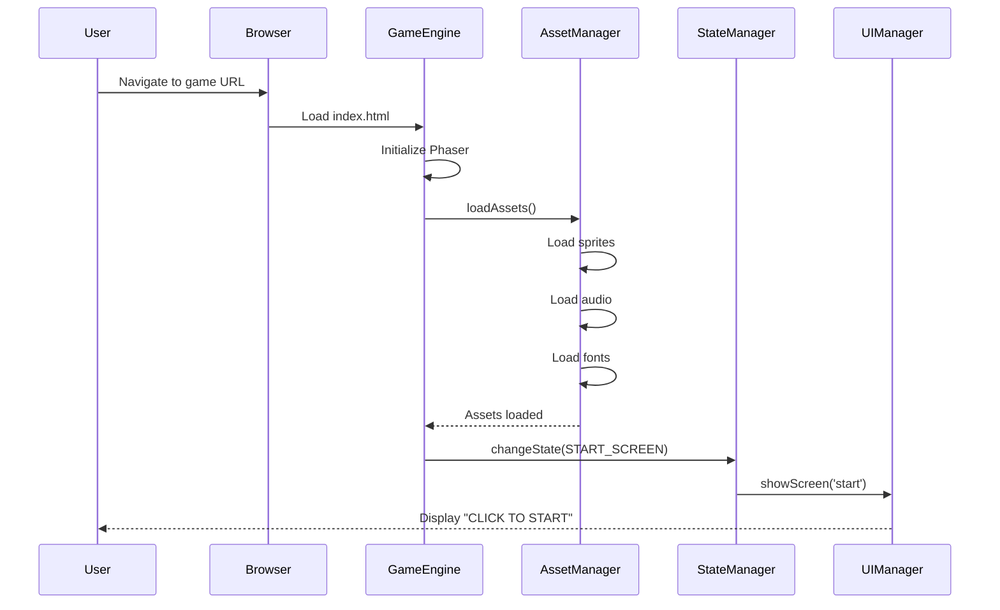
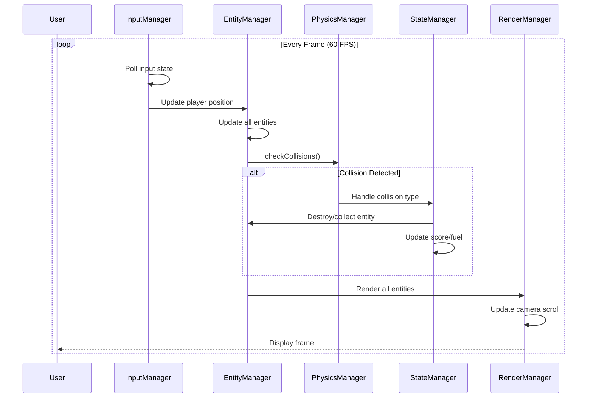
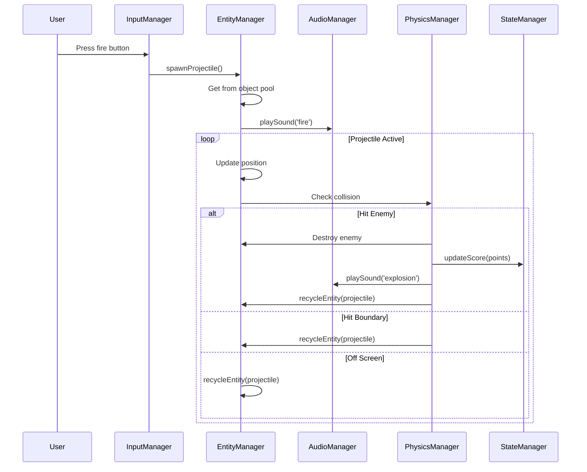
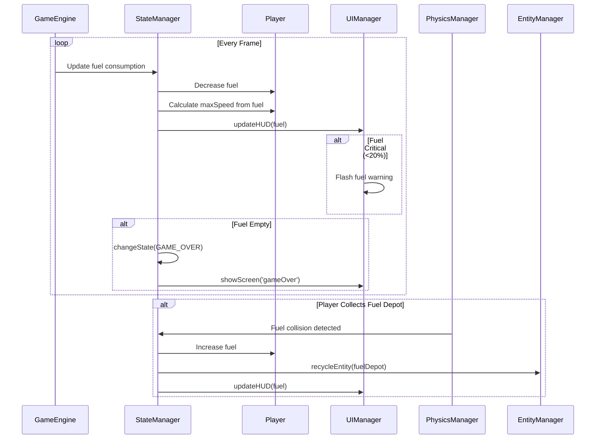
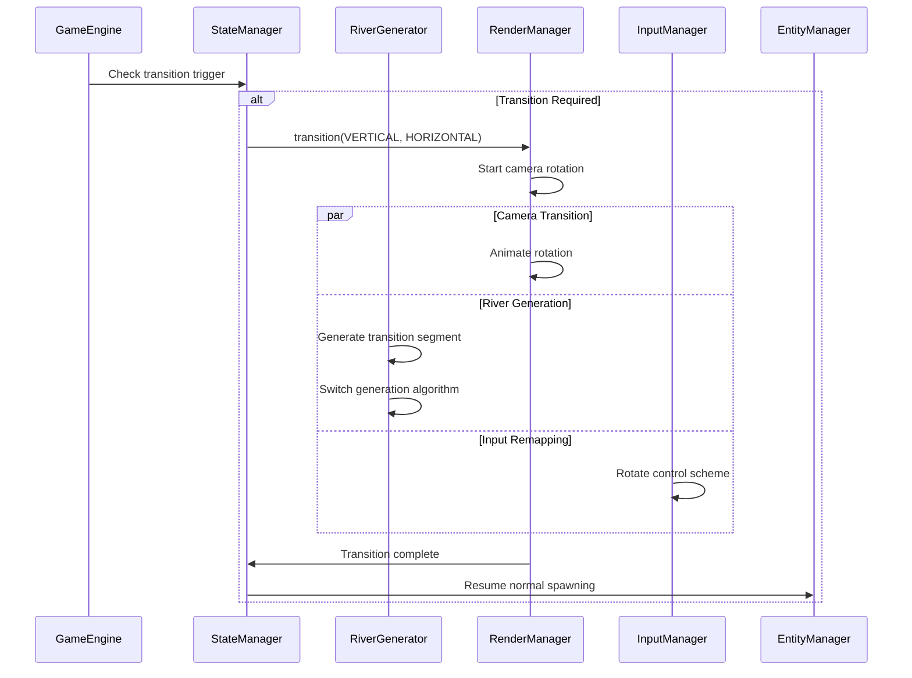
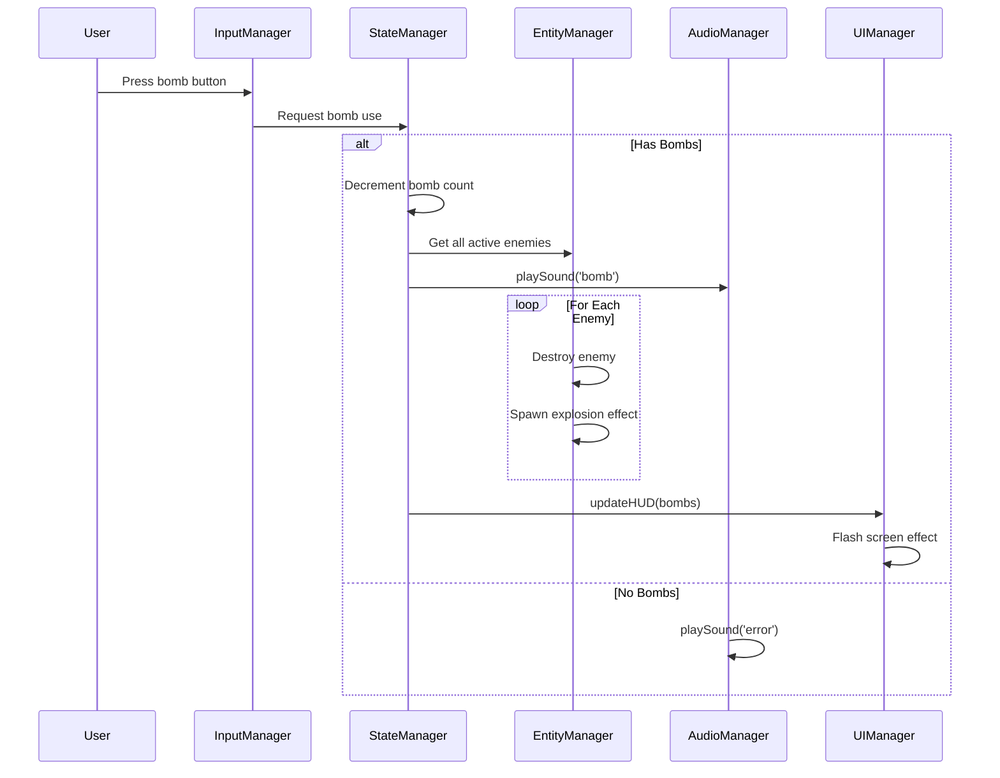
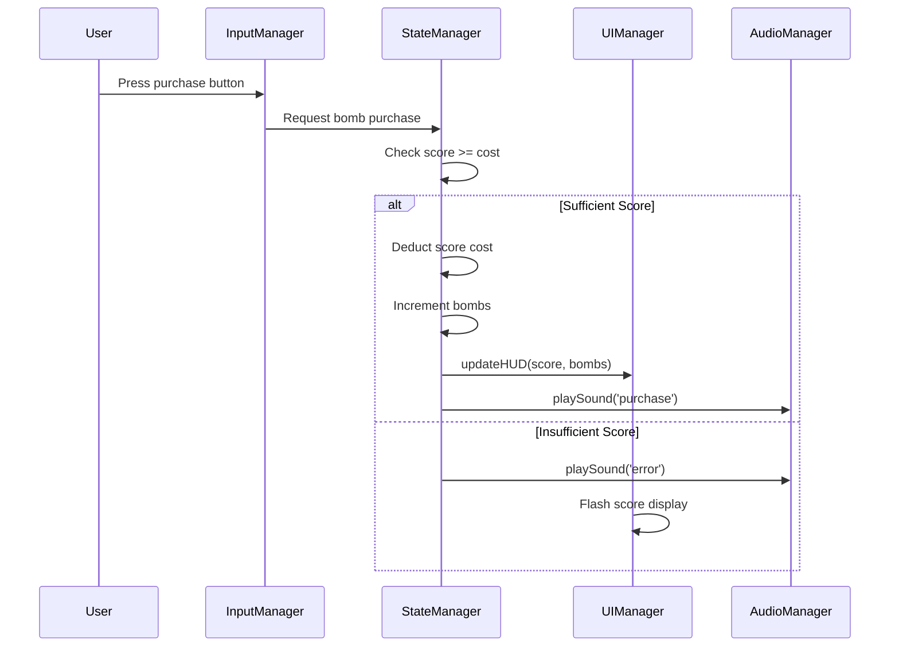

# Section 8: Core Workflows

Illustrate key system workflows using sequence diagrams:

### Game Initialization Workflow

### Core Gameplay Loop

### Player Fire Action Workflow

### Fuel Management Workflow

### Dynamic Scroll Direction Transition

### Bomb Usage Workflow

### Score-to-Bomb Purchase

---

