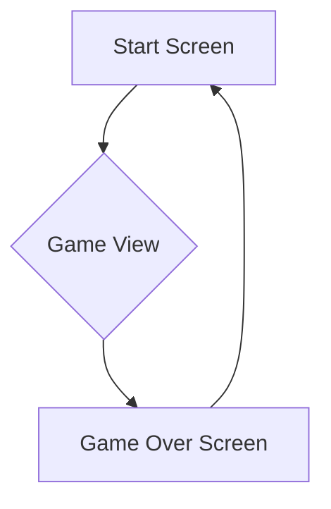
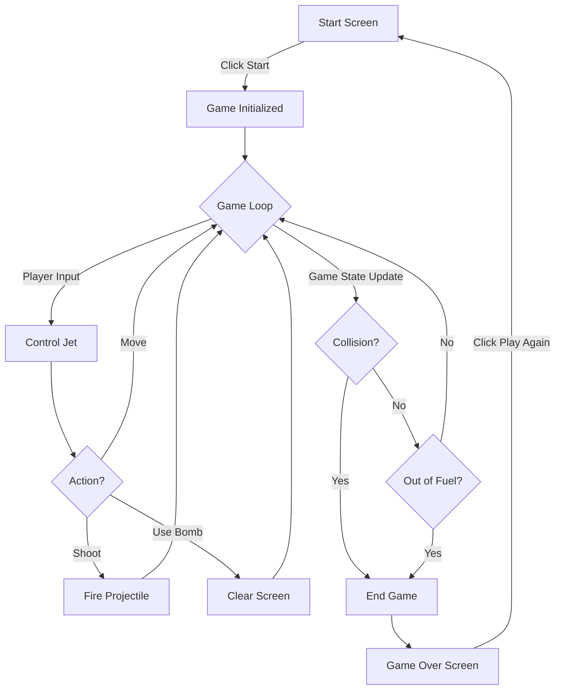

# River Raid JS UI/UX Specification

## Section 1: Introduction

This document defines the user experience goals, information architecture, user flows, and visual design specifications for the **River Raid JS** user interface. It serves as the foundation for visual design and frontend development, ensuring a cohesive and user-centered experience.

### Section 1.1: Overall UX Goals & Principles

#### Target User Personas
*   **The Retro Gaming Enthusiast:** Ages 30-50, values authenticity but appreciates quality-of-life improvements. Needs a convenient, high-quality way to relive a cherished gaming memory.
*   **The Casual Web Gamer:** Any age, plays browser games in short bursts. Needs a game that is easy to learn, loads quickly, and is instantly engaging without a tutorial.

#### Usability Goals
*   **Ease of Learning:** A new player should understand how to play (move, shoot, refuel) within the first 30 seconds of gameplay without any instructions.
*   **Efficiency of Use:** Controls for core actions (movement, shooting, bombing) must be immediate and responsive.
*   **Memorability:** The core gameplay loop should be simple enough that an infrequent player can return after weeks and not have to relearn the controls.

#### Design Principles
1.  **Arcade First:** Prioritize an immediate "pick up and play" experience over complex menus or tutorials. The game should feel like a modern arcade cabinet.
2.  **Clarity Over Clutter:** The game screen and HUD should be clean, presenting only essential information. Every element on screen must serve a clear purpose for gameplay.
3.  **Responsive & Fast:** The UI must be lightweight, load instantly, and respond immediately to player input to maintain the feel of a fast-paced action game.
4.  **Authentic, Not Archaic:** The visual style should evoke the Atari era's aesthetic (pixel art, limited palettes) but be executed with modern polish and clarity. Avoid slavishly copying old limitations that detract from usability (e.g., color choices that have poor contrast).

### Section 1.2: Change Log

| Date | Version | Description | Author |
| :--- | :--- | :--- | :--- |
| 2025-09-25 | 1.0 | Initial draft of UI/UX Specification | Sally, UX Expert |

***

## Section 2: Information Architecture (IA)

#### Site Map / Screen Inventory



#### Navigation Structure

*   **Primary Navigation:** The primary navigation is a simple, linear flow: from the **Start Screen**, the user initiates the game to enter the **Game View**. Upon losing, they are taken to the **Game Over Screen**, from which they can choose to play again, returning them to the **Start Screen** to begin a new session.
*   **Secondary Navigation:** None. To maintain simplicity, there are no options menus, settings pages, or other secondary navigation paths.
*   **Breadcrumb Strategy:** Not applicable for this type of linear, single-page application.

***

## Section 3: User Flows

### Flow: Core Gameplay Loop

**User Goal:** The user wants to play a complete round of the game, from starting a new session to reaching the "Game Over" screen, while trying to achieve a high score.

**Entry Points:** Clicking the "Start" prompt on the Start Screen.

**Success Criteria:** The user can successfully play the game, understands the objectives (shoot, refuel, avoid crashing), and is presented with their final score upon losing.

#### Flow Diagram



#### Edge Cases & Error Handling:

*   **Browser Tab Loses Focus:** If the player switches to another tab or window, the game should automatically pause. When the tab is refocused, a "Click to Resume" overlay should appear.
*   **Asset Loading Failure:** If essential game assets (sprites, sounds) fail to load, a user-friendly error message should be displayed on the Start Screen instead of a broken game.
*   **Rapid Window Resizing:** The game should handle rapid or extreme changes in browser window size gracefully, perhaps by pausing and resizing the game canvas without crashing.

***

## Section 4: Wireframes & Mockups

**Primary Design Files:** A link to a dedicated design tool like Figma or Miro will be provided here once high-fidelity mockups are created. For now, we will use the layouts below.

### Key Screen Layouts

#### Screen: Start Screen

**Purpose:** To present the game title and provide a clear entry point into the game.

**Key Elements:**

```
+--------------------------------------------------+
|                                                  |
|                                                  |
|                  RIVER RAID JS                   |
|               (Game Logo/Title)                  |
|                                                  |
|                                                  |
|               [ CLICK TO START ]                 |
|                                                  |
|                                                  |
+--------------------------------------------------+
```

**Interaction Notes:** A single click or tap anywhere on the screen should immediately start the game.

#### Screen: Game View

**Purpose:** The main gameplay screen, providing all necessary information to the player without distracting from the action.

**Key Elements:**

```
+--------------------------------------------------+
| SCORE: 001250   BOMBS: 2   FUEL: [||||||----]    |  <-- HUD
|--------------------------------------------------|
|                                                  |
|                                                  |
|                                                  |
|                        ^                         |  <-- Player Jet
|                                                  |
|                                                  |
|                                                  |
|                                                  |
+--------------------------------------------------+
```

**Interaction Notes:** The HUD is fixed at the top of the screen. The game world scrolls beneath it. For mobile, touch controls (e.g., a virtual joystick or drag-to-move area) would overlay the bottom portion of the screen.

#### Screen: Game Over Screen

**Purpose:** To inform the player that their game has ended and display their final score, encouraging them to play again.

**Key Elements:**

```
+--------------------------------------------------+
|                                                  |
|                    GAME OVER                     |
|                                                  |
|                 FINAL SCORE: 001250              |
|                                                  |
|                [ PLAY AGAIN? ]                   |
|                                                  |
|                                                  |
+--------------------------------------------------+
```

**Interaction Notes:** Clicking or tapping "PLAY AGAIN?" should return the user to the Start Screen.

***

## Section 5: Component Library / Design System

**Design System Approach:** A formal, complex design system is not required for this project. Instead, we will define a small, consistent set of core UI components that will be reused across the game's screens (Start, Game Over, and the HUD).

### Core Components

#### Component: Game Logo/Title
*   **Purpose:** To display the game's title, "River Raid JS", on the Start Screen.
*   **Variants:** A single variant will be used.
*   **States:** None (static).
*   **Usage Guidelines:** Should be the most prominent element on the Start Screen. The style should evoke 1980s video game box art.

#### Component: HUD Readout
*   **Purpose:** To display a key piece of player information (e.g., "SCORE:", "BOMBS:") and its corresponding value.
*   **Variants:** Three variants will be used: Score, Bombs, and Fuel.
*   **States:** The value part of the readout will be dynamic, updating in real-time.
*   **Usage Guidelines:** Should use a clear, pixelated font that is legible against the game background. All readouts should be aligned and grouped together to form the HUD.

#### Component: Fuel Meter
*   **Purpose:** To provide an immediate visual representation of the player's remaining fuel.
*   **Variants:** A single horizontal bar.
*   **States:** The meter will have a "fill" state that depletes from right to left. The color of the bar may change (e.g., from green to yellow to red) as fuel becomes critically low.
*   **Usage Guidelines:** Should be positioned within the HUD for constant visibility.

#### Component: Action Prompt
*   **Purpose:** To instruct the user on how to proceed (e.g., "[ CLICK TO START ]", "[ PLAY AGAIN? ]").
*   **Variants:** Start and Play Again.
*   **States:** The prompt can have a subtle "pulse" or glow animation to draw the user's attention. It will also have a "pressed" state upon user interaction.
*   **Usage Guidelines:** Should be centrally located and clear in its instruction.

***

## Section 6: Branding & Style Guide

#### Visual Identity
*   **Brand Guidelines:** The overall visual identity will be heavily inspired by the box art and in-game graphics of Atari 2600 games. The aesthetic is defined by pixel art, a limited but vibrant color palette, and chunky, readable typography.

#### Color Palette
| Color Type | Hex Code | Usage |
| :--- | :--- | :--- |
| Primary | `#00A8F3` | Player Jet, UI Highlights |
| Secondary | `#D9002D` | Enemies, Destructive Actions, Warnings |
| Accent | `#F3A505` | Explosions, Important Pickups (Fuel) |
| Success | `#4CAF50` | Fuel Meter (Full) |
| Warning | `#FFC107` | Fuel Meter (Medium) |
| Error | `#F44336` | Fuel Meter (Low), Game Over Text |
| Neutral | `#FFFFFF`, `#000000` | HUD Text, Backgrounds, Borders |

#### Typography
*   **Font Families:**
    *   **Primary:** "[Press Start 2P](https://fonts.google.com/specimen/Press+Start+2P)" - a pixel-perfect font ideal for all in-game text (HUD, menus).
    *   **Secondary:** None.
    *   **Monospace:** Not applicable.
*   **Type Scale:** A single font size will be used for all UI text to maintain a consistent arcade feel. The size will be determined during implementation to ensure legibility across target screen sizes.

#### Iconography
*   **Icon Library:** No external icon library will be used. All icons (e.g., a bomb symbol for the HUD) will be created as pixel art sprites in the same style as the other game assets.
*   **Usage Guidelines:** Icons should be simple, recognizable, and use the established color palette.

#### Spacing & Layout
*   **Grid System:** A formal grid is not necessary. Layouts will be balanced visually, with elements centered or aligned to the screen edges.
*   **Spacing Scale:** Spacing will be managed in multiples of a base unit (e.g., 8 pixels) to ensure a consistent, blocky, pixel-perfect alignment.

***

## Section 7: Accessibility Requirements

**Compliance Target:**
*   **Standard:** Aim for WCAG 2.1 Level AA compliance, with the understanding that the core real-time gameplay may not meet all criteria. The focus will be on UI elements and alternative controls.

**Key Requirements:**
*   **Visual:**
    *   **Color Contrast:** All HUD text and UI elements will meet or exceed a 4.5:1 contrast ratio against their background.
    *   **Focus Indicators:** While not a form-heavy application, any interactive element (like the "Play Again" button) will have a clear and visible focus state.
    *   **Text Sizing:** Text will be rendered in a pixel font, but its final size will be tested to ensure it is legible on a typical mobile screen without needing to zoom.
*   **Interaction:**
    *   **Keyboard Navigation:** The game must be fully playable using only the keyboard. All actions (movement, shoot, bomb, start) must be mappable to keyboard keys.
    *   **Screen Reader Support:** Screen reader support for the core gameplay is not feasible. However, UI screens (Start, Game Over) will use proper HTML semantics to announce the game title, final score, and action prompts.
    *   **Touch Targets:** On mobile, any on-screen buttons or touch areas will be large enough to be easily and accurately pressed.
*   **Content:**
    *   **Alternative Text:** Not applicable for game sprites.
    *   **Heading Structure:** Not applicable for game UI.
    *   **Form Labels:** Not applicable.

**Testing Strategy:**
*   Accessibility will be tested manually using a combination of keyboard-only navigation and browser-based accessibility audit tools (like Lighthouse) to check for contrast ratios and other machine-testable issues.

***

## Section 8: Responsiveness Strategy

#### Breakpoints
A traditional breakpoint system is not ideal for this application. Instead, the game canvas will be rendered at a fixed resolution (e.g., 320x480) and then scaled up or down to fit the user's browser window, while always maintaining its aspect ratio. This prevents UI elements from changing position and ensures a consistent gameplay experience regardless of screen size.

| Breakpoint | Min Width | Max Width | Target Devices |
| :--- | :--- | :--- | :--- |
| Mobile | 320px | 767px | Smartphones |
| Tablet | 768px | 1023px | Tablets |
| Desktop | 1024px | - | Laptops, Desktops |

#### Adaptation Patterns
*   **Layout Changes:** The layout of the game itself is fixed and does not change. The entire game canvas scales to fit the viewport.
*   **Navigation Changes:** Not applicable.
*   **Content Priority:** Not applicable.
*   **Interaction Changes:** This is the key area of adaptation.
    *   On **Desktop**, the game will be controlled exclusively via the keyboard (arrow keys, spacebar, etc.).
    *   On **Mobile/Tablet**, on-screen touch controls will be displayed. The primary control method will be "drag-to-move" in the main screen area, with dedicated on-screen buttons for "Fire" and "Bomb".

***

## Section 9: Animation & Micro-interactions

#### Motion Principles
*   **Feedback is King:** All animations should serve a purpose, primarily to provide immediate and clear feedback for player actions (e.g., shooting, collecting fuel, enemy destruction).
*   **Pixel-Perfect Motion:** Animations should be frame-by-frame (sprite-based) rather than using smooth, fluid tweens. This will maintain the authentic retro aesthetic.
*   **Keep it Snappy:** Durations should be short and punchy to match the fast-paced nature of the gameplay.

#### Key Animations
*   **Player Jet Thrust:** A simple, looping animation of the jet's engine exhaust to show it's active. (Duration: 100ms loop, Easing: None)
*   **Projectile Firing:** A small muzzle flash effect when a projectile is fired. (Duration: 50ms, Easing: None)
*   **Enemy/Player Explosion:** A multi-frame sprite animation for the destruction of jets, helicopters, and ships. This should be the most visually impactful animation. (Duration: 250ms, Easing: None)
*   **UI Prompt Pulse:** The main action prompts ("[ CLICK TO START ]", "[ PLAY AGAIN? ]") will have a subtle, slow pulse effect to draw the eye. (Duration: 1500ms loop, Easing: Sine)
*   **Fuel Depot Collection:** A quick flash or particle effect when the player successfully collects fuel. (Duration: 150ms, Easing: None)

***

## Section 10: Performance Considerations

#### Performance Goals
*   **Page Load:** The game should load to the interactive "Click to Start" screen in under 2 seconds on a standard broadband connection.
*   **Interaction Response:** Player input (move, shoot) must be processed and reflected on screen in the next available frame (<16ms).
*   **Animation FPS:** The game must maintain a consistent 60 frames per second during active gameplay.

#### Design Strategies
*   **Asset Optimization:** The use of pixel art with a limited color palette will keep image asset files small, contributing to faster load times.
*   **Minimalist UI:** The UI is intentionally simple, avoiding complex DOM elements or CSS effects that could slow down rendering. The game will be rendered primarily to a single `<canvas>` element.
*   **Simple Animations:** Animations are sprite-based and computationally inexpensive, avoiding performance-heavy techniques like complex particle systems.
*   **Client-Side Logic:** All game logic runs on the client, eliminating any network latency during gameplay.

***

## Section 11: Next Steps

#### Immediate Actions
1.  **Stakeholder Review:** This UI/UX Specification document should be reviewed and approved by all relevant stakeholders.
2.  **Visual Design Mockups:** Create high-fidelity mockups for the Start Screen, Game View (including HUD), and Game Over screen in a design tool like Figma, based on the wireframes and Style Guide defined in this document.
3.  **Asset Creation:** Begin creation of all required pixel art assets (player jet, enemies, fuel depots, environment tiles, UI icons) based on the established visual style.
4.  **Handoff to Development:** Once visual designs are approved, this specification and all related assets will be handed off to the development team to begin implementation.

#### Design Handoff Checklist
*   [x] All user flows documented
*   [x] Component inventory complete
*   [x] Accessibility requirements defined
*   [x] Responsive strategy clear
*   [x] Brand guidelines incorporated
*   [x] Performance goals established

## Section 12: Checklist Results
*No UI/UX checklist has been provided to run against this document. This section is a placeholder.*